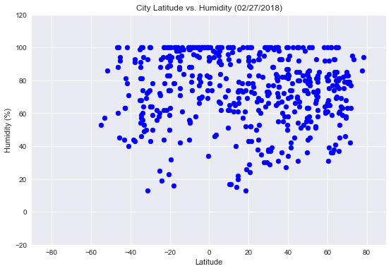
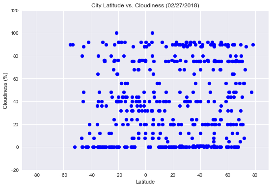
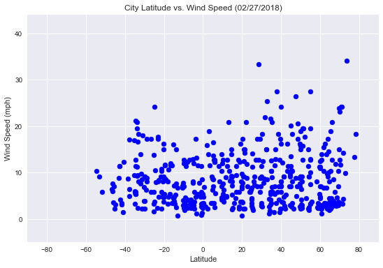

# WeatherPy

### Analysis
* Observed trend 1  
  Temperature has a strong relationship with the latitude of a location.  Generally, the lower the latitude, the higher the temperature.
  
  
  <br>

* Observed trend 2  
  Cities in lower latitudes seems to have a narrower spread of humidity numbers and most of them have high humidities, however, the correlation is not very strong.
  
  
  <br>
  

* Observed trend 3  
  There is no obvious evidence to show relationships between latitude and cloudiness or wind speed.
  
  
  <br>
  
  [Link to codes and results](https://github.com/nelsonxw/Python_API_Challenge/blob/master/weather.ipynb)


```python
# import dependencies
import time
import datetime
import pandas as pd
import requests as req
import matplotlib.pyplot as plt
import seaborn as sns
from citipy import citipy
import config
```


```python
# define range of latitude and Longitude to select locations
lat = range(-90,90,5)
lon = range(-180,180,10)
# extract current date for use as analysis date
current_date = datetime.date.today().strftime('%m/%d/%Y')
```

## Generate Cities List
```python
# create list of locations with latitude and longitude
loc = [(x,y) for x in lat for y in lon]
# create cities as a list to hold nearest cities based on the Latitude and Longitude
cities = []
# use citipy to find the nearest cities and associated country codes based on the Latitude and Longitude
for lat,lon in loc:
    city_found = citipy.nearest_city(lat,lon)
    cityname = city_found.city_name
    countrycode = city_found.country_code
    # add the city name and country code only when it doesn't exist in the list of cities
    if (cityname,countrycode) not in cities:
        cities.append((cityname,countrycode))
```

## Perform API Calls
```python
# create a list to hold retrieved data
results = []
# define API endpoint, key and unit value
url = 'http://api.openweathermap.org/data/2.5/weather?'
api_key = config.api_key
unit = 'imperial'
record_count = 0
# print the header of the data retrieval log
print('Beginning Data Retrieval')
print('-' * 100)
# call API and save retrived data for all the cities
for city,country in cities:
    query = url + "appid=" + api_key + '&units=' + unit + '&q=' + city + ',' + country
    response = req.get(query).json()
    # only save data when the city name is found.  If not found or error occurs, skip the city
    try:
        # print data retrieval log with count of record, city number and city name
        print('Processing Record ' + str(record_count + 1) + ' | city number: '  + str(response['id']) + ' | city name: ' + response['name'])
        # add response to results list
        results.append(response)
        # add the number of records retrieved
        record_count += 1
        # print the requested URL       
        print(query)
        # since the free key only allows us to call API 60 times in a minute, pause the call every second to avoid breaching the limit
        time.sleep(1)
    # if error happens, skip and continue to the next city
    except:
        continue
# print the end of retrieval log
print('-' * 100)
print('Data Retrieval Complete - ' + str(record_count) + ' records have been retrieved.')
print('-' * 100)
```

    Beginning Data Retrieval
    ----------------------------------------------------------------------------------------------------
    Processing Record 1 | city number: 4032243 | city name: Vaini
    http://api.openweathermap.org/data/2.5/weather?appid=25bc90a1196e6f153eece0bc0b0fc9eb&units=imperial&q=vaini,to
    Processing Record 2 | city number: 4030556 | city name: Rikitea
    http://api.openweathermap.org/data/2.5/weather?appid=25bc90a1196e6f153eece0bc0b0fc9eb&units=imperial&q=rikitea,pf
    Processing Record 3 | city number: 3874787 | city name: Punta Arenas
    http://api.openweathermap.org/data/2.5/weather?appid=25bc90a1196e6f153eece0bc0b0fc9eb&units=imperial&q=punta arenas,cl
    Processing Record 4 | city number: 3833367 | city name: Ushuaia
    http://api.openweathermap.org/data/2.5/weather?appid=25bc90a1196e6f153eece0bc0b0fc9eb&units=imperial&q=ushuaia,ar
    Processing Record 5 | city number: 3366880 | city name: Hermanus
    http://api.openweathermap.org/data/2.5/weather?appid=25bc90a1196e6f153eece0bc0b0fc9eb&units=imperial&q=hermanus,za
    Processing Record 6 | city number: 1015776 | city name: Bredasdorp
    http://api.openweathermap.org/data/2.5/weather?appid=25bc90a1196e6f153eece0bc0b0fc9eb&units=imperial&q=bredasdorp,za
    Processing Record 7 | city number: 986717 | city name: Kruisfontein
    http://api.openweathermap.org/data/2.5/weather?appid=25bc90a1196e6f153eece0bc0b0fc9eb&units=imperial&q=kruisfontein,za
    Processing Record 8 | city number: 964420 | city name: Port Elizabeth
    http://api.openweathermap.org/data/2.5/weather?appid=25bc90a1196e6f153eece0bc0b0fc9eb&units=imperial&q=port elizabeth,za
    Processing Record 9 | city number: 964432 | city name: Port Alfred
    http://api.openweathermap.org/data/2.5/weather?appid=25bc90a1196e6f153eece0bc0b0fc9eb&units=imperial&q=port alfred,za
    Processing Record 10 | city number: 1006984 | city name: East London
    http://api.openweathermap.org/data/2.5/weather?appid=25bc90a1196e6f153eece0bc0b0fc9eb&units=imperial&q=east london,za
    Processing Record 11 | city number: 2075265 | city name: Busselton
    http://api.openweathermap.org/data/2.5/weather?appid=25bc90a1196e6f153eece0bc0b0fc9eb&units=imperial&q=busselton,au
    Processing Record 12 | city number: 2077963 | city name: Albany
    http://api.openweathermap.org/data/2.5/weather?appid=25bc90a1196e6f153eece0bc0b0fc9eb&units=imperial&q=albany,au
    Processing Record 13 | city number: 2155415 | city name: New Norfolk
    http://api.openweathermap.org/data/2.5/weather?appid=25bc90a1196e6f153eece0bc0b0fc9eb&units=imperial&q=new norfolk,au
    Processing Record 14 | city number: 2163355 | city name: Hobart
    http://api.openweathermap.org/data/2.5/weather?appid=25bc90a1196e6f153eece0bc0b0fc9eb&units=imperial&q=hobart,au
    Processing Record 15 | city number: 2206939 | city name: Bluff
    http://api.openweathermap.org/data/2.5/weather?appid=25bc90a1196e6f153eece0bc0b0fc9eb&units=imperial&q=bluff,nz
    Processing Record 16 | city number: 3369157 | city name: Cape Town
    http://api.openweathermap.org/data/2.5/weather?appid=25bc90a1196e6f153eece0bc0b0fc9eb&units=imperial&q=cape town,za
    Processing Record 17 | city number: 3863379 | city name: Mar del Plata
    http://api.openweathermap.org/data/2.5/weather?appid=25bc90a1196e6f153eece0bc0b0fc9eb&units=imperial&q=mar del plata,ar
    Processing Record 18 | city number: 3443061 | city name: Chuy
    http://api.openweathermap.org/data/2.5/weather?appid=25bc90a1196e6f153eece0bc0b0fc9eb&units=imperial&q=chuy,uy
    Processing Record 19 | city number: 935215 | city name: Saint-Philippe
    http://api.openweathermap.org/data/2.5/weather?appid=25bc90a1196e6f153eece0bc0b0fc9eb&units=imperial&q=saint-philippe,re
    Processing Record 20 | city number: 3466165 | city name: Cidreira
    http://api.openweathermap.org/data/2.5/weather?appid=25bc90a1196e6f153eece0bc0b0fc9eb&units=imperial&q=cidreira,br
    Processing Record 21 | city number: 3896218 | city name: Castro
    http://api.openweathermap.org/data/2.5/weather?appid=25bc90a1196e6f153eece0bc0b0fc9eb&units=imperial&q=castro,cl
    Processing Record 22 | city number: 3471451 | city name: Arraial do Cabo
    http://api.openweathermap.org/data/2.5/weather?appid=25bc90a1196e6f153eece0bc0b0fc9eb&units=imperial&q=arraial do cabo,br
    Processing Record 23 | city number: 934322 | city name: Mahebourg
    http://api.openweathermap.org/data/2.5/weather?appid=25bc90a1196e6f153eece0bc0b0fc9eb&units=imperial&q=mahebourg,mu
    Processing Record 24 | city number: 2156643 | city name: Mount Gambier
    http://api.openweathermap.org/data/2.5/weather?appid=25bc90a1196e6f153eece0bc0b0fc9eb&units=imperial&q=mount gambier,au
    Processing Record 25 | city number: 2180815 | city name: Tuatapere
    http://api.openweathermap.org/data/2.5/weather?appid=25bc90a1196e6f153eece0bc0b0fc9eb&units=imperial&q=tuatapere,nz
    Processing Record 26 | city number: 3894426 | city name: Coihaique
    http://api.openweathermap.org/data/2.5/weather?appid=25bc90a1196e6f153eece0bc0b0fc9eb&units=imperial&q=coihaique,cl
    Processing Record 27 | city number: 3838859 | city name: Rio Gallegos
    http://api.openweathermap.org/data/2.5/weather?appid=25bc90a1196e6f153eece0bc0b0fc9eb&units=imperial&q=rio gallegos,ar
    Processing Record 28 | city number: 3839307 | city name: Rawson
    http://api.openweathermap.org/data/2.5/weather?appid=25bc90a1196e6f153eece0bc0b0fc9eb&units=imperial&q=rawson,ar
    Processing Record 29 | city number: 3440777 | city name: Rocha
    http://api.openweathermap.org/data/2.5/weather?appid=25bc90a1196e6f153eece0bc0b0fc9eb&units=imperial&q=rocha,uy
    Processing Record 30 | city number: 2208248 | city name: Kaitangata
    http://api.openweathermap.org/data/2.5/weather?appid=25bc90a1196e6f153eece0bc0b0fc9eb&units=imperial&q=kaitangata,nz
    Processing Record 31 | city number: 4035715 | city name: Avarua
    http://api.openweathermap.org/data/2.5/weather?appid=25bc90a1196e6f153eece0bc0b0fc9eb&units=imperial&q=avarua,ck
    Processing Record 32 | city number: 3832899 | city name: Viedma
    http://api.openweathermap.org/data/2.5/weather?appid=25bc90a1196e6f153eece0bc0b0fc9eb&units=imperial&q=viedma,ar
    Processing Record 33 | city number: 3370903 | city name: Jamestown
    http://api.openweathermap.org/data/2.5/weather?appid=25bc90a1196e6f153eece0bc0b0fc9eb&units=imperial&q=jamestown,sh
    Processing Record 34 | city number: 933995 | city name: Souillac
    http://api.openweathermap.org/data/2.5/weather?appid=25bc90a1196e6f153eece0bc0b0fc9eb&units=imperial&q=souillac,mu
    Processing Record 35 | city number: 2063036 | city name: Port Lincoln
    http://api.openweathermap.org/data/2.5/weather?appid=25bc90a1196e6f153eece0bc0b0fc9eb&units=imperial&q=port lincoln,au
    Processing Record 36 | city number: 2152668 | city name: Portland
    http://api.openweathermap.org/data/2.5/weather?appid=25bc90a1196e6f153eece0bc0b0fc9eb&units=imperial&q=portland,au
    Processing Record 37 | city number: 2181625 | city name: Te Anau
    http://api.openweathermap.org/data/2.5/weather?appid=25bc90a1196e6f153eece0bc0b0fc9eb&units=imperial&q=te anau,nz
    Processing Record 38 | city number: 2183774 | city name: Ranfurly
    http://api.openweathermap.org/data/2.5/weather?appid=25bc90a1196e6f153eece0bc0b0fc9eb&units=imperial&q=ranfurly,nz
    Processing Record 39 | city number: 3899695 | city name: Ancud
    http://api.openweathermap.org/data/2.5/weather?appid=25bc90a1196e6f153eece0bc0b0fc9eb&units=imperial&q=ancud,cl
    Processing Record 40 | city number: 7647007 | city name: San Carlos de Bariloche
    http://api.openweathermap.org/data/2.5/weather?appid=25bc90a1196e6f153eece0bc0b0fc9eb&units=imperial&q=san carlos de bariloche,ar
    Processing Record 41 | city number: 3833859 | city name: Tres Arroyos
    http://api.openweathermap.org/data/2.5/weather?appid=25bc90a1196e6f153eece0bc0b0fc9eb&units=imperial&q=tres arroyos,ar
    Processing Record 42 | city number: 3361934 | city name: Saldanha
    http://api.openweathermap.org/data/2.5/weather?appid=25bc90a1196e6f153eece0bc0b0fc9eb&units=imperial&q=saldanha,za
    Processing Record 43 | city number: 978895 | city name: Margate
    http://api.openweathermap.org/data/2.5/weather?appid=25bc90a1196e6f153eece0bc0b0fc9eb&units=imperial&q=margate,za
    Processing Record 44 | city number: 2160735 | city name: Lakes Entrance
    http://api.openweathermap.org/data/2.5/weather?appid=25bc90a1196e6f153eece0bc0b0fc9eb&units=imperial&q=lakes entrance,au
    Processing Record 45 | city number: 2206900 | city name: Westport
    http://api.openweathermap.org/data/2.5/weather?appid=25bc90a1196e6f153eece0bc0b0fc9eb&units=imperial&q=westport,nz
    Processing Record 46 | city number: 3883457 | city name: Lebu
    http://api.openweathermap.org/data/2.5/weather?appid=25bc90a1196e6f153eece0bc0b0fc9eb&units=imperial&q=lebu,cl
    Processing Record 47 | city number: 3873441 | city name: Rengo
    http://api.openweathermap.org/data/2.5/weather?appid=25bc90a1196e6f153eece0bc0b0fc9eb&units=imperial&q=rengo,cl
    Processing Record 48 | city number: 3861344 | city name: Chivilcoy
    http://api.openweathermap.org/data/2.5/weather?appid=25bc90a1196e6f153eece0bc0b0fc9eb&units=imperial&q=chivilcoy,ar
    Processing Record 49 | city number: 3451138 | city name: Rio Grande
    http://api.openweathermap.org/data/2.5/weather?appid=25bc90a1196e6f153eece0bc0b0fc9eb&units=imperial&q=rio grande,br
    Processing Record 50 | city number: 3355672 | city name: Luderitz
    http://api.openweathermap.org/data/2.5/weather?appid=25bc90a1196e6f153eece0bc0b0fc9eb&units=imperial&q=luderitz,na
    Processing Record 51 | city number: 962367 | city name: Richards Bay
    http://api.openweathermap.org/data/2.5/weather?appid=25bc90a1196e6f153eece0bc0b0fc9eb&units=imperial&q=richards bay,za
    Processing Record 52 | city number: 1106677 | city name: Bambous Virieux
    http://api.openweathermap.org/data/2.5/weather?appid=25bc90a1196e6f153eece0bc0b0fc9eb&units=imperial&q=bambous virieux,mu
    Processing Record 53 | city number: 6255012 | city name: Flinders
    http://api.openweathermap.org/data/2.5/weather?appid=25bc90a1196e6f153eece0bc0b0fc9eb&units=imperial&q=flinders,au
    Processing Record 54 | city number: 2065176 | city name: Murray Bridge
    http://api.openweathermap.org/data/2.5/weather?appid=25bc90a1196e6f153eece0bc0b0fc9eb&units=imperial&q=murray bridge,au
    Processing Record 55 | city number: 2164837 | city name: Goulburn
    http://api.openweathermap.org/data/2.5/weather?appid=25bc90a1196e6f153eece0bc0b0fc9eb&units=imperial&q=goulburn,au
    Processing Record 56 | city number: 2152659 | city name: Port Macquarie
    http://api.openweathermap.org/data/2.5/weather?appid=25bc90a1196e6f153eece0bc0b0fc9eb&units=imperial&q=port macquarie,au
    Processing Record 57 | city number: 2194098 | city name: Ahipara
    http://api.openweathermap.org/data/2.5/weather?appid=25bc90a1196e6f153eece0bc0b0fc9eb&units=imperial&q=ahipara,nz
    Processing Record 58 | city number: 3893629 | city name: Coquimbo
    http://api.openweathermap.org/data/2.5/weather?appid=25bc90a1196e6f153eece0bc0b0fc9eb&units=imperial&q=coquimbo,cl
    Processing Record 59 | city number: 3868308 | city name: Vicuna
    http://api.openweathermap.org/data/2.5/weather?appid=25bc90a1196e6f153eece0bc0b0fc9eb&units=imperial&q=vicuna,cl
    Processing Record 60 | city number: 3429594 | city name: Reconquista
    http://api.openweathermap.org/data/2.5/weather?appid=25bc90a1196e6f153eece0bc0b0fc9eb&units=imperial&q=reconquista,ar
    Processing Record 61 | city number: 3446232 | city name: Tramandai
    http://api.openweathermap.org/data/2.5/weather?appid=25bc90a1196e6f153eece0bc0b0fc9eb&units=imperial&q=tramandai,br
    Processing Record 62 | city number: 3448903 | city name: Sao Joao da Barra
    http://api.openweathermap.org/data/2.5/weather?appid=25bc90a1196e6f153eece0bc0b0fc9eb&units=imperial&q=sao joao da barra,br
    Processing Record 63 | city number: 3369174 | city name: Calvinia
    http://api.openweathermap.org/data/2.5/weather?appid=25bc90a1196e6f153eece0bc0b0fc9eb&units=imperial&q=calvinia,za
    Processing Record 64 | city number: 962330 | city name: Richmond
    http://api.openweathermap.org/data/2.5/weather?appid=25bc90a1196e6f153eece0bc0b0fc9eb&units=imperial&q=richmond,za
    Processing Record 65 | city number: 1067565 | city name: Beloha
    http://api.openweathermap.org/data/2.5/weather?appid=25bc90a1196e6f153eece0bc0b0fc9eb&units=imperial&q=beloha,mg
    Processing Record 66 | city number: 2074865 | city name: Carnarvon
    http://api.openweathermap.org/data/2.5/weather?appid=25bc90a1196e6f153eece0bc0b0fc9eb&units=imperial&q=carnarvon,au
    Processing Record 67 | city number: 2070998 | city name: Geraldton
    http://api.openweathermap.org/data/2.5/weather?appid=25bc90a1196e6f153eece0bc0b0fc9eb&units=imperial&q=geraldton,au
    Processing Record 68 | city number: 2064550 | city name: Northam
    http://api.openweathermap.org/data/2.5/weather?appid=25bc90a1196e6f153eece0bc0b0fc9eb&units=imperial&q=northam,au
    Processing Record 69 | city number: 6355222 | city name: Yulara
    http://api.openweathermap.org/data/2.5/weather?appid=25bc90a1196e6f153eece0bc0b0fc9eb&units=imperial&q=yulara,au
    Processing Record 70 | city number: 2173911 | city name: Broken Hill
    http://api.openweathermap.org/data/2.5/weather?appid=25bc90a1196e6f153eece0bc0b0fc9eb&units=imperial&q=broken hill,au
    Processing Record 71 | city number: 2155742 | city name: Narrabri
    http://api.openweathermap.org/data/2.5/weather?appid=25bc90a1196e6f153eece0bc0b0fc9eb&units=imperial&q=narrabri,au
    Processing Record 72 | city number: 2172880 | city name: Byron Bay
    http://api.openweathermap.org/data/2.5/weather?appid=25bc90a1196e6f153eece0bc0b0fc9eb&units=imperial&q=byron bay,au
    Processing Record 73 | city number: 4036284 | city name: Alofi
    http://api.openweathermap.org/data/2.5/weather?appid=25bc90a1196e6f153eece0bc0b0fc9eb&units=imperial&q=alofi,nu
    Processing Record 74 | city number: 3652764 | city name: Puerto Ayora
    http://api.openweathermap.org/data/2.5/weather?appid=25bc90a1196e6f153eece0bc0b0fc9eb&units=imperial&q=puerto ayora,ec
    Processing Record 75 | city number: 3870243 | city name: Taltal
    http://api.openweathermap.org/data/2.5/weather?appid=25bc90a1196e6f153eece0bc0b0fc9eb&units=imperial&q=taltal,cl
    Processing Record 76 | city number: 3840300 | city name: Presidencia Roque Saenz Pena
    http://api.openweathermap.org/data/2.5/weather?appid=25bc90a1196e6f153eece0bc0b0fc9eb&units=imperial&q=presidencia roque saenz pena,ar
    Processing Record 77 | city number: 3467042 | city name: Carambei
    http://api.openweathermap.org/data/2.5/weather?appid=25bc90a1196e6f153eece0bc0b0fc9eb&units=imperial&q=carambei,br
    Processing Record 78 | city number: 6320062 | city name: Vila Velha
    http://api.openweathermap.org/data/2.5/weather?appid=25bc90a1196e6f153eece0bc0b0fc9eb&units=imperial&q=vila velha,br
    Processing Record 79 | city number: 3359638 | city name: Walvis Bay
    http://api.openweathermap.org/data/2.5/weather?appid=25bc90a1196e6f153eece0bc0b0fc9eb&units=imperial&q=walvis bay,na
    Processing Record 80 | city number: 3358666 | city name: Aranos
    http://api.openweathermap.org/data/2.5/weather?appid=25bc90a1196e6f153eece0bc0b0fc9eb&units=imperial&q=aranos,na
    Processing Record 81 | city number: 981158 | city name: Lydenburg
    http://api.openweathermap.org/data/2.5/weather?appid=25bc90a1196e6f153eece0bc0b0fc9eb&units=imperial&q=lydenburg,za
    Processing Record 82 | city number: 1054329 | city name: Vangaindrano
    http://api.openweathermap.org/data/2.5/weather?appid=25bc90a1196e6f153eece0bc0b0fc9eb&units=imperial&q=vangaindrano,mg
    Processing Record 83 | city number: 2063042 | city name: Port Hedland
    http://api.openweathermap.org/data/2.5/weather?appid=25bc90a1196e6f153eece0bc0b0fc9eb&units=imperial&q=port hedland,au
    Processing Record 84 | city number: 2065594 | city name: Mount Isa
    http://api.openweathermap.org/data/2.5/weather?appid=25bc90a1196e6f153eece0bc0b0fc9eb&units=imperial&q=mount isa,au
    Processing Record 85 | city number: 2175819 | city name: Biloela
    http://api.openweathermap.org/data/2.5/weather?appid=25bc90a1196e6f153eece0bc0b0fc9eb&units=imperial&q=biloela,au
    Processing Record 86 | city number: 2140558 | city name: Koumac
    http://api.openweathermap.org/data/2.5/weather?appid=25bc90a1196e6f153eece0bc0b0fc9eb&units=imperial&q=koumac,nc
    Processing Record 87 | city number: 2137773 | city name: Vao
    http://api.openweathermap.org/data/2.5/weather?appid=25bc90a1196e6f153eece0bc0b0fc9eb&units=imperial&q=vao,nc
    Processing Record 88 | city number: 4033543 | city name: Teahupoo
    http://api.openweathermap.org/data/2.5/weather?appid=25bc90a1196e6f153eece0bc0b0fc9eb&units=imperial&q=teahupoo,pf
    Processing Record 89 | city number: 3932145 | city name: Pisco
    http://api.openweathermap.org/data/2.5/weather?appid=25bc90a1196e6f153eece0bc0b0fc9eb&units=imperial&q=pisco,pe
    Processing Record 90 | city number: 3887127 | city name: Iquique
    http://api.openweathermap.org/data/2.5/weather?appid=25bc90a1196e6f153eece0bc0b0fc9eb&units=imperial&q=iquique,cl
    Processing Record 91 | city number: 3867427 | city name: Mayor Pablo Lagerenza
    http://api.openweathermap.org/data/2.5/weather?appid=25bc90a1196e6f153eece0bc0b0fc9eb&units=imperial&q=mayor pablo lagerenza,py
    Processing Record 92 | city number: 3466970 | city name: Cardoso
    http://api.openweathermap.org/data/2.5/weather?appid=25bc90a1196e6f153eece0bc0b0fc9eb&units=imperial&q=cardoso,br
    Processing Record 93 | city number: 3447779 | city name: Serra
    http://api.openweathermap.org/data/2.5/weather?appid=25bc90a1196e6f153eece0bc0b0fc9eb&units=imperial&q=serra,br
    Processing Record 94 | city number: 3466980 | city name: Caravelas
    http://api.openweathermap.org/data/2.5/weather?appid=25bc90a1196e6f153eece0bc0b0fc9eb&units=imperial&q=caravelas,br
    Processing Record 95 | city number: 2411397 | city name: Georgetown
    http://api.openweathermap.org/data/2.5/weather?appid=25bc90a1196e6f153eece0bc0b0fc9eb&units=imperial&q=georgetown,sh
    Processing Record 96 | city number: 3354077 | city name: Opuwo
    http://api.openweathermap.org/data/2.5/weather?appid=25bc90a1196e6f153eece0bc0b0fc9eb&units=imperial&q=opuwo,na
    Processing Record 97 | city number: 3357114 | city name: Grootfontein
    http://api.openweathermap.org/data/2.5/weather?appid=25bc90a1196e6f153eece0bc0b0fc9eb&units=imperial&q=grootfontein,na
    Processing Record 98 | city number: 881164 | city name: Shurugwi
    http://api.openweathermap.org/data/2.5/weather?appid=25bc90a1196e6f153eece0bc0b0fc9eb&units=imperial&q=shurugwi,zw
    Processing Record 99 | city number: 1024312 | city name: Mocuba
    http://api.openweathermap.org/data/2.5/weather?appid=25bc90a1196e6f153eece0bc0b0fc9eb&units=imperial&q=mocuba,mz
    Processing Record 100 | city number: 1062553 | city name: Mahanoro
    http://api.openweathermap.org/data/2.5/weather?appid=25bc90a1196e6f153eece0bc0b0fc9eb&units=imperial&q=mahanoro,mg
    Processing Record 101 | city number: 1282256 | city name: Hithadhoo
    http://api.openweathermap.org/data/2.5/weather?appid=25bc90a1196e6f153eece0bc0b0fc9eb&units=imperial&q=hithadhoo,mv
    Processing Record 102 | city number: 2068110 | city name: Kununurra
    http://api.openweathermap.org/data/2.5/weather?appid=25bc90a1196e6f153eece0bc0b0fc9eb&units=imperial&q=kununurra,au
    Processing Record 103 | city number: 2159220 | city name: Mackay
    http://api.openweathermap.org/data/2.5/weather?appid=25bc90a1196e6f153eece0bc0b0fc9eb&units=imperial&q=mackay,au
    Processing Record 104 | city number: 2138555 | city name: Poum
    http://api.openweathermap.org/data/2.5/weather?appid=25bc90a1196e6f153eece0bc0b0fc9eb&units=imperial&q=poum,nc
    Processing Record 105 | city number: 2136825 | city name: Isangel
    http://api.openweathermap.org/data/2.5/weather?appid=25bc90a1196e6f153eece0bc0b0fc9eb&units=imperial&q=isangel,vu
    Processing Record 106 | city number: 4034496 | city name: Fare
    http://api.openweathermap.org/data/2.5/weather?appid=25bc90a1196e6f153eece0bc0b0fc9eb&units=imperial&q=fare,pf
    Processing Record 107 | city number: 4020109 | city name: Atuona
    http://api.openweathermap.org/data/2.5/weather?appid=25bc90a1196e6f153eece0bc0b0fc9eb&units=imperial&q=atuona,pf
    Processing Record 108 | city number: 3939168 | city name: Huarmey
    http://api.openweathermap.org/data/2.5/weather?appid=25bc90a1196e6f153eece0bc0b0fc9eb&units=imperial&q=huarmey,pe
    Processing Record 109 | city number: 3946937 | city name: Azangaro
    http://api.openweathermap.org/data/2.5/weather?appid=25bc90a1196e6f153eece0bc0b0fc9eb&units=imperial&q=azangaro,pe
    Processing Record 110 | city number: 3453060 | city name: Pontes e Lacerda
    http://api.openweathermap.org/data/2.5/weather?appid=25bc90a1196e6f153eece0bc0b0fc9eb&units=imperial&q=pontes e lacerda,br
    Processing Record 111 | city number: 3450843 | city name: Rubiataba
    http://api.openweathermap.org/data/2.5/weather?appid=25bc90a1196e6f153eece0bc0b0fc9eb&units=imperial&q=rubiataba,br
    Processing Record 112 | city number: 3461602 | city name: Ibicui
    http://api.openweathermap.org/data/2.5/weather?appid=25bc90a1196e6f153eece0bc0b0fc9eb&units=imperial&q=ibicui,br
    Processing Record 113 | city number: 3395981 | city name: Maceio
    http://api.openweathermap.org/data/2.5/weather?appid=25bc90a1196e6f153eece0bc0b0fc9eb&units=imperial&q=maceio,br
    Processing Record 114 | city number: 3347019 | city name: Namibe
    http://api.openweathermap.org/data/2.5/weather?appid=25bc90a1196e6f153eece0bc0b0fc9eb&units=imperial&q=namibe,ao
    Processing Record 115 | city number: 3347353 | city name: Menongue
    http://api.openweathermap.org/data/2.5/weather?appid=25bc90a1196e6f153eece0bc0b0fc9eb&units=imperial&q=menongue,ao
    Processing Record 116 | city number: 911148 | city name: Luangwa
    http://api.openweathermap.org/data/2.5/weather?appid=25bc90a1196e6f153eece0bc0b0fc9eb&units=imperial&q=luangwa,zm
    Processing Record 117 | city number: 1071296 | city name: Antalaha
    http://api.openweathermap.org/data/2.5/weather?appid=25bc90a1196e6f153eece0bc0b0fc9eb&units=imperial&q=antalaha,mg
    Processing Record 118 | city number: 934649 | city name: Cap Malheureux
    http://api.openweathermap.org/data/2.5/weather?appid=25bc90a1196e6f153eece0bc0b0fc9eb&units=imperial&q=cap malheureux,mu
    Processing Record 119 | city number: 1106643 | city name: Quatre Cocos
    http://api.openweathermap.org/data/2.5/weather?appid=25bc90a1196e6f153eece0bc0b0fc9eb&units=imperial&q=quatre cocos,mu
    Processing Record 120 | city number: 1650434 | city name: Bambanglipuro
    http://api.openweathermap.org/data/2.5/weather?appid=25bc90a1196e6f153eece0bc0b0fc9eb&units=imperial&q=bambanglipuro,id
    Processing Record 121 | city number: 2075720 | city name: Broome
    http://api.openweathermap.org/data/2.5/weather?appid=25bc90a1196e6f153eece0bc0b0fc9eb&units=imperial&q=broome,au
    Processing Record 122 | city number: 2063039 | city name: Port Keats
    http://api.openweathermap.org/data/2.5/weather?appid=25bc90a1196e6f153eece0bc0b0fc9eb&units=imperial&q=port keats,au
    Processing Record 123 | city number: 2079582 | city name: Alyangula
    http://api.openweathermap.org/data/2.5/weather?appid=25bc90a1196e6f153eece0bc0b0fc9eb&units=imperial&q=alyangula,au
    Processing Record 124 | city number: 2132606 | city name: Samarai
    http://api.openweathermap.org/data/2.5/weather?appid=25bc90a1196e6f153eece0bc0b0fc9eb&units=imperial&q=samarai,pg
    Processing Record 125 | city number: 2178753 | city name: Kirakira
    http://api.openweathermap.org/data/2.5/weather?appid=25bc90a1196e6f153eece0bc0b0fc9eb&units=imperial&q=kirakira,sb
    Processing Record 126 | city number: 2134814 | city name: Sola
    http://api.openweathermap.org/data/2.5/weather?appid=25bc90a1196e6f153eece0bc0b0fc9eb&units=imperial&q=sola,vu
    Processing Record 127 | city number: 4034551 | city name: Faanui
    http://api.openweathermap.org/data/2.5/weather?appid=25bc90a1196e6f153eece0bc0b0fc9eb&units=imperial&q=faanui,pf
    Processing Record 128 | city number: 3652567 | city name: San Cristobal
    http://api.openweathermap.org/data/2.5/weather?appid=25bc90a1196e6f153eece0bc0b0fc9eb&units=imperial&q=san cristobal,ec
    Processing Record 129 | city number: 3698304 | city name: Chimbote
    http://api.openweathermap.org/data/2.5/weather?appid=25bc90a1196e6f153eece0bc0b0fc9eb&units=imperial&q=chimbote,pe
    Processing Record 130 | city number: 3663495 | city name: Manoel Urbano
    http://api.openweathermap.org/data/2.5/weather?appid=25bc90a1196e6f153eece0bc0b0fc9eb&units=imperial&q=manoel urbano,br
    Processing Record 131 | city number: 3665202 | city name: Aripuana
    http://api.openweathermap.org/data/2.5/weather?appid=25bc90a1196e6f153eece0bc0b0fc9eb&units=imperial&q=aripuana,br
    Processing Record 132 | city number: 3460225 | city name: Jaguarari
    http://api.openweathermap.org/data/2.5/weather?appid=25bc90a1196e6f153eece0bc0b0fc9eb&units=imperial&q=jaguarari,br
    Processing Record 133 | city number: 3456160 | city name: Olinda
    http://api.openweathermap.org/data/2.5/weather?appid=25bc90a1196e6f153eece0bc0b0fc9eb&units=imperial&q=olinda,br
    Processing Record 134 | city number: 2240449 | city name: Luanda
    http://api.openweathermap.org/data/2.5/weather?appid=25bc90a1196e6f153eece0bc0b0fc9eb&units=imperial&q=luanda,ao
    Processing Record 135 | city number: 145531 | city name: Saurimo
    http://api.openweathermap.org/data/2.5/weather?appid=25bc90a1196e6f153eece0bc0b0fc9eb&units=imperial&q=saurimo,ao
    Processing Record 136 | city number: 908913 | city name: Luwingu
    http://api.openweathermap.org/data/2.5/weather?appid=25bc90a1196e6f153eece0bc0b0fc9eb&units=imperial&q=luwingu,zm
    Processing Record 137 | city number: 878281 | city name: Lindi
    http://api.openweathermap.org/data/2.5/weather?appid=25bc90a1196e6f153eece0bc0b0fc9eb&units=imperial&q=lindi,tz
    Processing Record 138 | city number: 1082243 | city name: Ambilobe
    http://api.openweathermap.org/data/2.5/weather?appid=25bc90a1196e6f153eece0bc0b0fc9eb&units=imperial&q=ambilobe,mg
    Processing Record 139 | city number: 241131 | city name: Victoria
    http://api.openweathermap.org/data/2.5/weather?appid=25bc90a1196e6f153eece0bc0b0fc9eb&units=imperial&q=victoria,sc
    Processing Record 140 | city number: 1622318 | city name: Waingapu
    http://api.openweathermap.org/data/2.5/weather?appid=25bc90a1196e6f153eece0bc0b0fc9eb&units=imperial&q=waingapu,id
    Processing Record 141 | city number: 2082539 | city name: Merauke
    http://api.openweathermap.org/data/2.5/weather?appid=25bc90a1196e6f153eece0bc0b0fc9eb&units=imperial&q=merauke,id
    Processing Record 142 | city number: 2108502 | city name: Honiara
    http://api.openweathermap.org/data/2.5/weather?appid=25bc90a1196e6f153eece0bc0b0fc9eb&units=imperial&q=honiara,sb
    Processing Record 143 | city number: 3694582 | city name: Morropon
    http://api.openweathermap.org/data/2.5/weather?appid=25bc90a1196e6f153eece0bc0b0fc9eb&units=imperial&q=morropon,pe
    Processing Record 144 | city number: 3665016 | city name: Benjamin Constant
    http://api.openweathermap.org/data/2.5/weather?appid=25bc90a1196e6f153eece0bc0b0fc9eb&units=imperial&q=benjamin constant,br
    Processing Record 145 | city number: 3663142 | city name: Novo Aripuana
    http://api.openweathermap.org/data/2.5/weather?appid=25bc90a1196e6f153eece0bc0b0fc9eb&units=imperial&q=novo aripuana,br
    Processing Record 146 | city number: 3397851 | city name: Itupiranga
    http://api.openweathermap.org/data/2.5/weather?appid=25bc90a1196e6f153eece0bc0b0fc9eb&units=imperial&q=itupiranga,br
    Processing Record 147 | city number: 3405616 | city name: Boa Viagem
    http://api.openweathermap.org/data/2.5/weather?appid=25bc90a1196e6f153eece0bc0b0fc9eb&units=imperial&q=boa viagem,br
    Processing Record 148 | city number: 3404558 | city name: Cabedelo
    http://api.openweathermap.org/data/2.5/weather?appid=25bc90a1196e6f153eece0bc0b0fc9eb&units=imperial&q=cabedelo,br
    Processing Record 149 | city number: 2396518 | city name: Port-Gentil
    http://api.openweathermap.org/data/2.5/weather?appid=25bc90a1196e6f153eece0bc0b0fc9eb&units=imperial&q=port-gentil,ga
    Processing Record 150 | city number: 2399001 | city name: Mayumba
    http://api.openweathermap.org/data/2.5/weather?appid=25bc90a1196e6f153eece0bc0b0fc9eb&units=imperial&q=mayumba,ga
    Processing Record 151 | city number: 215976 | city name: Ilebo
    http://api.openweathermap.org/data/2.5/weather?appid=25bc90a1196e6f153eece0bc0b0fc9eb&units=imperial&q=ilebo,cd
    Processing Record 152 | city number: 153709 | city name: Mwandiga
    http://api.openweathermap.org/data/2.5/weather?appid=25bc90a1196e6f153eece0bc0b0fc9eb&units=imperial&q=mwandiga,tz
    Processing Record 153 | city number: 153955 | city name: Micheweni
    http://api.openweathermap.org/data/2.5/weather?appid=25bc90a1196e6f153eece0bc0b0fc9eb&units=imperial&q=micheweni,tz
    Processing Record 154 | city number: 1214488 | city name: Meulaboh
    http://api.openweathermap.org/data/2.5/weather?appid=25bc90a1196e6f153eece0bc0b0fc9eb&units=imperial&q=meulaboh,id
    Processing Record 155 | city number: 1635164 | city name: Mlonggo
    http://api.openweathermap.org/data/2.5/weather?appid=25bc90a1196e6f153eece0bc0b0fc9eb&units=imperial&q=mlonggo,id
    Processing Record 156 | city number: 1626895 | city name: Sinjai
    http://api.openweathermap.org/data/2.5/weather?appid=25bc90a1196e6f153eece0bc0b0fc9eb&units=imperial&q=sinjai,id
    Processing Record 157 | city number: 1651591 | city name: Amahai
    http://api.openweathermap.org/data/2.5/weather?appid=25bc90a1196e6f153eece0bc0b0fc9eb&units=imperial&q=amahai,id
    Processing Record 158 | city number: 2093846 | city name: Kiunga
    http://api.openweathermap.org/data/2.5/weather?appid=25bc90a1196e6f153eece0bc0b0fc9eb&units=imperial&q=kiunga,pg
    Processing Record 159 | city number: 2093967 | city name: Kimbe
    http://api.openweathermap.org/data/2.5/weather?appid=25bc90a1196e6f153eece0bc0b0fc9eb&units=imperial&q=kimbe,pg
    Processing Record 160 | city number: 2109528 | city name: Buala
    http://api.openweathermap.org/data/2.5/weather?appid=25bc90a1196e6f153eece0bc0b0fc9eb&units=imperial&q=buala,sb
    Processing Record 161 | city number: 4004293 | city name: Ixtapa
    http://api.openweathermap.org/data/2.5/weather?appid=25bc90a1196e6f153eece0bc0b0fc9eb&units=imperial&q=ixtapa,mx
    Processing Record 162 | city number: 3653307 | city name: Pedernales
    http://api.openweathermap.org/data/2.5/weather?appid=25bc90a1196e6f153eece0bc0b0fc9eb&units=imperial&q=pedernales,ec
    Processing Record 163 | city number: 3674676 | city name: Mitu
    http://api.openweathermap.org/data/2.5/weather?appid=25bc90a1196e6f153eece0bc0b0fc9eb&units=imperial&q=mitu,co
    Processing Record 164 | city number: 3664980 | city name: Boa Vista
    http://api.openweathermap.org/data/2.5/weather?appid=25bc90a1196e6f153eece0bc0b0fc9eb&units=imperial&q=boa vista,br
    Processing Record 165 | city number: 3386213 | city name: Touros
    http://api.openweathermap.org/data/2.5/weather?appid=25bc90a1196e6f153eece0bc0b0fc9eb&units=imperial&q=touros,br
    Processing Record 166 | city number: 2276492 | city name: Harper
    http://api.openweathermap.org/data/2.5/weather?appid=25bc90a1196e6f153eece0bc0b0fc9eb&units=imperial&q=harper,lr
    Processing Record 167 | city number: 2294915 | city name: Takoradi
    http://api.openweathermap.org/data/2.5/weather?appid=25bc90a1196e6f153eece0bc0b0fc9eb&units=imperial&q=takoradi,gh
    Processing Record 168 | city number: 2400682 | city name: Kango
    http://api.openweathermap.org/data/2.5/weather?appid=25bc90a1196e6f153eece0bc0b0fc9eb&units=imperial&q=kango,ga
    Processing Record 169 | city number: 218680 | city name: Boende
    http://api.openweathermap.org/data/2.5/weather?appid=25bc90a1196e6f153eece0bc0b0fc9eb&units=imperial&q=boende,cd
    Processing Record 170 | city number: 231250 | city name: Kilembe
    http://api.openweathermap.org/data/2.5/weather?appid=25bc90a1196e6f153eece0bc0b0fc9eb&units=imperial&q=kilembe,ug
    Processing Record 171 | city number: 197745 | city name: Garissa
    http://api.openweathermap.org/data/2.5/weather?appid=25bc90a1196e6f153eece0bc0b0fc9eb&units=imperial&q=garissa,ke
    Processing Record 172 | city number: 53654 | city name: Mogadishu
    http://api.openweathermap.org/data/2.5/weather?appid=25bc90a1196e6f153eece0bc0b0fc9eb&units=imperial&q=mogadishu,so
    Processing Record 173 | city number: 1337610 | city name: Thinadhoo
    http://api.openweathermap.org/data/2.5/weather?appid=25bc90a1196e6f153eece0bc0b0fc9eb&units=imperial&q=thinadhoo,mv
    Processing Record 174 | city number: 1235846 | city name: Matara
    http://api.openweathermap.org/data/2.5/weather?appid=25bc90a1196e6f153eece0bc0b0fc9eb&units=imperial&q=matara,lk
    Processing Record 175 | city number: 1631905 | city name: Payakumbuh
    http://api.openweathermap.org/data/2.5/weather?appid=25bc90a1196e6f153eece0bc0b0fc9eb&units=imperial&q=payakumbuh,id
    Processing Record 176 | city number: 1630789 | city name: Pontianak
    http://api.openweathermap.org/data/2.5/weather?appid=25bc90a1196e6f153eece0bc0b0fc9eb&units=imperial&q=pontianak,id
    Processing Record 177 | city number: 1633034 | city name: Palu
    http://api.openweathermap.org/data/2.5/weather?appid=25bc90a1196e6f153eece0bc0b0fc9eb&units=imperial&q=palu,id
    Processing Record 178 | city number: 1626542 | city name: Sorong
    http://api.openweathermap.org/data/2.5/weather?appid=25bc90a1196e6f153eece0bc0b0fc9eb&units=imperial&q=sorong,id
    Processing Record 179 | city number: 2084442 | city name: Vanimo
    http://api.openweathermap.org/data/2.5/weather?appid=25bc90a1196e6f153eece0bc0b0fc9eb&units=imperial&q=vanimo,pg
    Processing Record 180 | city number: 2094342 | city name: Kavieng
    http://api.openweathermap.org/data/2.5/weather?appid=25bc90a1196e6f153eece0bc0b0fc9eb&units=imperial&q=kavieng,pg
    Processing Record 181 | city number: 2094027 | city name: Kieta
    http://api.openweathermap.org/data/2.5/weather?appid=25bc90a1196e6f153eece0bc0b0fc9eb&units=imperial&q=kieta,pg
    Processing Record 182 | city number: 5855927 | city name: Hilo
    http://api.openweathermap.org/data/2.5/weather?appid=25bc90a1196e6f153eece0bc0b0fc9eb&units=imperial&q=hilo,us
    Processing Record 183 | city number: 3985710 | city name: Cabo San Lucas
    http://api.openweathermap.org/data/2.5/weather?appid=25bc90a1196e6f153eece0bc0b0fc9eb&units=imperial&q=cabo san lucas,mx
    Processing Record 184 | city number: 3981460 | city name: Coahuayana
    http://api.openweathermap.org/data/2.5/weather?appid=25bc90a1196e6f153eece0bc0b0fc9eb&units=imperial&q=coahuayana,mx
    Processing Record 185 | city number: 3520994 | city name: Puerto Escondido
    http://api.openweathermap.org/data/2.5/weather?appid=25bc90a1196e6f153eece0bc0b0fc9eb&units=imperial&q=puerto escondido,mx
    Processing Record 186 | city number: 3707058 | city name: La Palma
    http://api.openweathermap.org/data/2.5/weather?appid=25bc90a1196e6f153eece0bc0b0fc9eb&units=imperial&q=la palma,pa
    Processing Record 187 | city number: 3379316 | city name: Lethem
    http://api.openweathermap.org/data/2.5/weather?appid=25bc90a1196e6f153eece0bc0b0fc9eb&units=imperial&q=lethem,gy
    Processing Record 188 | city number: 3374210 | city name: Sao Filipe
    http://api.openweathermap.org/data/2.5/weather?appid=25bc90a1196e6f153eece0bc0b0fc9eb&units=imperial&q=sao filipe,cv
    Processing Record 189 | city number: 2278158 | city name: Buchanan
    http://api.openweathermap.org/data/2.5/weather?appid=25bc90a1196e6f153eece0bc0b0fc9eb&units=imperial&q=buchanan,lr
    Processing Record 190 | city number: 2306104 | city name: Accra
    http://api.openweathermap.org/data/2.5/weather?appid=25bc90a1196e6f153eece0bc0b0fc9eb&units=imperial&q=accra,gh
    Processing Record 191 | city number: 2223763 | city name: Nkongsamba
    http://api.openweathermap.org/data/2.5/weather?appid=25bc90a1196e6f153eece0bc0b0fc9eb&units=imperial&q=nkongsamba,cm
    Processing Record 192 | city number: 2385535 | city name: Kouango
    http://api.openweathermap.org/data/2.5/weather?appid=25bc90a1196e6f153eece0bc0b0fc9eb&units=imperial&q=kouango,cf
    Processing Record 193 | city number: 328716 | city name: Shakiso
    http://api.openweathermap.org/data/2.5/weather?appid=25bc90a1196e6f153eece0bc0b0fc9eb&units=imperial&q=shakiso,et
    Processing Record 194 | city number: 57000 | city name: Hobyo
    http://api.openweathermap.org/data/2.5/weather?appid=25bc90a1196e6f153eece0bc0b0fc9eb&units=imperial&q=hobyo,so
    Processing Record 195 | city number: 64814 | city name: Bandarbeyla
    http://api.openweathermap.org/data/2.5/weather?appid=25bc90a1196e6f153eece0bc0b0fc9eb&units=imperial&q=bandarbeyla,so
    Processing Record 196 | city number: 1337606 | city name: Eydhafushi
    http://api.openweathermap.org/data/2.5/weather?appid=25bc90a1196e6f153eece0bc0b0fc9eb&units=imperial&q=eydhafushi,mv
    Processing Record 197 | city number: 1223738 | city name: Weligama
    http://api.openweathermap.org/data/2.5/weather?appid=25bc90a1196e6f153eece0bc0b0fc9eb&units=imperial&q=weligama,lk
    Processing Record 198 | city number: 1215502 | city name: Banda Aceh
    http://api.openweathermap.org/data/2.5/weather?appid=25bc90a1196e6f153eece0bc0b0fc9eb&units=imperial&q=banda aceh,id
    Processing Record 199 | city number: 1735902 | city name: Sibu
    http://api.openweathermap.org/data/2.5/weather?appid=25bc90a1196e6f153eece0bc0b0fc9eb&units=imperial&q=sibu,my
    Processing Record 200 | city number: 1694759 | city name: Parangan
    http://api.openweathermap.org/data/2.5/weather?appid=25bc90a1196e6f153eece0bc0b0fc9eb&units=imperial&q=parangan,ph
    Processing Record 201 | city number: 1698289 | city name: Pundaguitan
    http://api.openweathermap.org/data/2.5/weather?appid=25bc90a1196e6f153eece0bc0b0fc9eb&units=imperial&q=pundaguitan,ph
    Processing Record 202 | city number: 2092164 | city name: Lorengau
    http://api.openweathermap.org/data/2.5/weather?appid=25bc90a1196e6f153eece0bc0b0fc9eb&units=imperial&q=lorengau,pg
    Processing Record 203 | city number: 2090021 | city name: Namatanai
    http://api.openweathermap.org/data/2.5/weather?appid=25bc90a1196e6f153eece0bc0b0fc9eb&units=imperial&q=namatanai,pg
    Processing Record 204 | city number: 2110227 | city name: Butaritari
    http://api.openweathermap.org/data/2.5/weather?appid=25bc90a1196e6f153eece0bc0b0fc9eb&units=imperial&q=butaritari,ki
    Processing Record 205 | city number: 5848280 | city name: Kapaa
    http://api.openweathermap.org/data/2.5/weather?appid=25bc90a1196e6f153eece0bc0b0fc9eb&units=imperial&q=kapaa,us
    Processing Record 206 | city number: 3985168 | city name: San Patricio
    http://api.openweathermap.org/data/2.5/weather?appid=25bc90a1196e6f153eece0bc0b0fc9eb&units=imperial&q=san patricio,mx
    Processing Record 207 | city number: 3585157 | city name: La Libertad
    http://api.openweathermap.org/data/2.5/weather?appid=25bc90a1196e6f153eece0bc0b0fc9eb&units=imperial&q=la libertad,sv
    Processing Record 208 | city number: 3702577 | city name: Portobelo
    http://api.openweathermap.org/data/2.5/weather?appid=25bc90a1196e6f153eece0bc0b0fc9eb&units=imperial&q=portobelo,pa
    Processing Record 209 | city number: 3646487 | city name: Carora
    http://api.openweathermap.org/data/2.5/weather?appid=25bc90a1196e6f153eece0bc0b0fc9eb&units=imperial&q=carora,ve
    Processing Record 210 | city number: 3573840 | city name: Rio Claro
    http://api.openweathermap.org/data/2.5/weather?appid=25bc90a1196e6f153eece0bc0b0fc9eb&units=imperial&q=rio claro,tt
    Processing Record 211 | city number: 3380290 | city name: Sinnamary
    http://api.openweathermap.org/data/2.5/weather?appid=25bc90a1196e6f153eece0bc0b0fc9eb&units=imperial&q=sinnamary,gf
    Processing Record 212 | city number: 3402648 | city name: Carutapera
    http://api.openweathermap.org/data/2.5/weather?appid=25bc90a1196e6f153eece0bc0b0fc9eb&units=imperial&q=carutapera,br
    Processing Record 213 | city number: 2246901 | city name: Oussouye
    http://api.openweathermap.org/data/2.5/weather?appid=25bc90a1196e6f153eece0bc0b0fc9eb&units=imperial&q=oussouye,sn
    Processing Record 214 | city number: 2414659 | city name: Tokonou
    http://api.openweathermap.org/data/2.5/weather?appid=25bc90a1196e6f153eece0bc0b0fc9eb&units=imperial&q=tokonou,gn
    Processing Record 215 | city number: 2293801 | city name: Yendi
    http://api.openweathermap.org/data/2.5/weather?appid=25bc90a1196e6f153eece0bc0b0fc9eb&units=imperial&q=yendi,gh
    Processing Record 216 | city number: 2347470 | city name: Bauchi
    http://api.openweathermap.org/data/2.5/weather?appid=25bc90a1196e6f153eece0bc0b0fc9eb&units=imperial&q=bauchi,ng
    Processing Record 217 | city number: 245338 | city name: Am Timan
    http://api.openweathermap.org/data/2.5/weather?appid=25bc90a1196e6f153eece0bc0b0fc9eb&units=imperial&q=am timan,td
    Processing Record 218 | city number: 1267390 | city name: Kavaratti
    http://api.openweathermap.org/data/2.5/weather?appid=25bc90a1196e6f153eece0bc0b0fc9eb&units=imperial&q=kavaratti,in
    Processing Record 219 | city number: 1225142 | city name: Valvedditturai
    http://api.openweathermap.org/data/2.5/weather?appid=25bc90a1196e6f153eece0bc0b0fc9eb&units=imperial&q=valvedditturai,lk
    Processing Record 220 | city number: 1259385 | city name: Port Blair
    http://api.openweathermap.org/data/2.5/weather?appid=25bc90a1196e6f153eece0bc0b0fc9eb&units=imperial&q=port blair,in
    Processing Record 221 | city number: 1154689 | city name: Ko Samui
    http://api.openweathermap.org/data/2.5/weather?appid=25bc90a1196e6f153eece0bc0b0fc9eb&units=imperial&q=ko samui,th
    Processing Record 222 | city number: 1697549 | city name: Osmena
    http://api.openweathermap.org/data/2.5/weather?appid=25bc90a1196e6f153eece0bc0b0fc9eb&units=imperial&q=osmena,ph
    Processing Record 223 | city number: 1729564 | city name: Bacolod
    http://api.openweathermap.org/data/2.5/weather?appid=25bc90a1196e6f153eece0bc0b0fc9eb&units=imperial&q=bacolod,ph
    Processing Record 224 | city number: 5855051 | city name: Ewa Beach
    http://api.openweathermap.org/data/2.5/weather?appid=25bc90a1196e6f153eece0bc0b0fc9eb&units=imperial&q=ewa beach,us
    Processing Record 225 | city number: 4021858 | city name: Guerrero Negro
    http://api.openweathermap.org/data/2.5/weather?appid=25bc90a1196e6f153eece0bc0b0fc9eb&units=imperial&q=guerrero negro,mx
    Processing Record 226 | city number: 3533462 | city name: Acapulco
    http://api.openweathermap.org/data/2.5/weather?appid=25bc90a1196e6f153eece0bc0b0fc9eb&units=imperial&q=acapulco,mx
    Processing Record 227 | city number: 3590547 | city name: San Agustin Acasaguastlan
    http://api.openweathermap.org/data/2.5/weather?appid=25bc90a1196e6f153eece0bc0b0fc9eb&units=imperial&q=san agustin acasaguastlan,gt
    Processing Record 228 | city number: 7522928 | city name: San Andres
    http://api.openweathermap.org/data/2.5/weather?appid=25bc90a1196e6f153eece0bc0b0fc9eb&units=imperial&q=san andres,co
    Processing Record 229 | city number: 3577154 | city name: Oranjestad
    http://api.openweathermap.org/data/2.5/weather?appid=25bc90a1196e6f153eece0bc0b0fc9eb&units=imperial&q=oranjestad,aw
    Processing Record 230 | city number: 3570392 | city name: Le Vauclin
    http://api.openweathermap.org/data/2.5/weather?appid=25bc90a1196e6f153eece0bc0b0fc9eb&units=imperial&q=le vauclin,mq
    Processing Record 231 | city number: 3374083 | city name: Bathsheba
    http://api.openweathermap.org/data/2.5/weather?appid=25bc90a1196e6f153eece0bc0b0fc9eb&units=imperial&q=bathsheba,bb
    Processing Record 232 | city number: 3374346 | city name: Ponta do Sol
    http://api.openweathermap.org/data/2.5/weather?appid=25bc90a1196e6f153eece0bc0b0fc9eb&units=imperial&q=ponta do sol,cv
    Processing Record 233 | city number: 3374336 | city name: Porto Novo
    http://api.openweathermap.org/data/2.5/weather?appid=25bc90a1196e6f153eece0bc0b0fc9eb&units=imperial&q=porto novo,cv
    Processing Record 234 | city number: 2253354 | city name: Dakar
    http://api.openweathermap.org/data/2.5/weather?appid=25bc90a1196e6f153eece0bc0b0fc9eb&units=imperial&q=dakar,sn
    Processing Record 235 | city number: 2360372 | city name: Gorom-Gorom
    http://api.openweathermap.org/data/2.5/weather?appid=25bc90a1196e6f153eece0bc0b0fc9eb&units=imperial&q=gorom-gorom,bf
    Processing Record 236 | city number: 2444219 | city name: Goure
    http://api.openweathermap.org/data/2.5/weather?appid=25bc90a1196e6f153eece0bc0b0fc9eb&units=imperial&q=goure,ne
    Processing Record 237 | city number: 244878 | city name: Biltine
    http://api.openweathermap.org/data/2.5/weather?appid=25bc90a1196e6f153eece0bc0b0fc9eb&units=imperial&q=biltine,td
    Processing Record 238 | city number: 286621 | city name: Salalah
    http://api.openweathermap.org/data/2.5/weather?appid=25bc90a1196e6f153eece0bc0b0fc9eb&units=imperial&q=salalah,om
    Processing Record 239 | city number: 1267394 | city name: Kavali
    http://api.openweathermap.org/data/2.5/weather?appid=25bc90a1196e6f153eece0bc0b0fc9eb&units=imperial&q=kavali,in
    Processing Record 240 | city number: 1620010 | city name: Doembang Nangbuat
    http://api.openweathermap.org/data/2.5/weather?appid=25bc90a1196e6f153eece0bc0b0fc9eb&units=imperial&q=doembang nangbuat,th
    Processing Record 241 | city number: 1568770 | city name: Quang Ngai
    http://api.openweathermap.org/data/2.5/weather?appid=25bc90a1196e6f153eece0bc0b0fc9eb&units=imperial&q=quang ngai,vn
    Processing Record 242 | city number: 1688912 | city name: San Narciso
    http://api.openweathermap.org/data/2.5/weather?appid=25bc90a1196e6f153eece0bc0b0fc9eb&units=imperial&q=san narciso,ph
    Processing Record 243 | city number: 1688696 | city name: San Policarpo
    http://api.openweathermap.org/data/2.5/weather?appid=25bc90a1196e6f153eece0bc0b0fc9eb&units=imperial&q=san policarpo,ph
    Processing Record 244 | city number: 5367788 | city name: Lompoc
    http://api.openweathermap.org/data/2.5/weather?appid=25bc90a1196e6f153eece0bc0b0fc9eb&units=imperial&q=lompoc,us
    Processing Record 245 | city number: 4011743 | city name: Constitucion
    http://api.openweathermap.org/data/2.5/weather?appid=25bc90a1196e6f153eece0bc0b0fc9eb&units=imperial&q=constitucion,mx
    Processing Record 246 | city number: 3516049 | city name: Temascalcingo
    http://api.openweathermap.org/data/2.5/weather?appid=25bc90a1196e6f153eece0bc0b0fc9eb&units=imperial&q=temascalcingo,mx
    Processing Record 247 | city number: 3527149 | city name: Hecelchakan
    http://api.openweathermap.org/data/2.5/weather?appid=25bc90a1196e6f153eece0bc0b0fc9eb&units=imperial&q=hecelchakan,mx
    Processing Record 248 | city number: 3580733 | city name: Bodden Town
    http://api.openweathermap.org/data/2.5/weather?appid=25bc90a1196e6f153eece0bc0b0fc9eb&units=imperial&q=bodden town,ky
    Processing Record 249 | city number: 3492627 | city name: Sosua
    http://api.openweathermap.org/data/2.5/weather?appid=25bc90a1196e6f153eece0bc0b0fc9eb&units=imperial&q=sosua,do
    Processing Record 250 | city number: 2377457 | city name: Nouadhibou
    http://api.openweathermap.org/data/2.5/weather?appid=25bc90a1196e6f153eece0bc0b0fc9eb&units=imperial&q=nouadhibou,mr
    Processing Record 251 | city number: 2381334 | city name: Atar
    http://api.openweathermap.org/data/2.5/weather?appid=25bc90a1196e6f153eece0bc0b0fc9eb&units=imperial&q=atar,mr
    Processing Record 252 | city number: 2449893 | city name: Tessalit
    http://api.openweathermap.org/data/2.5/weather?appid=25bc90a1196e6f153eece0bc0b0fc9eb&units=imperial&q=tessalit,ml
    Processing Record 253 | city number: 2447513 | city name: Arlit
    http://api.openweathermap.org/data/2.5/weather?appid=25bc90a1196e6f153eece0bc0b0fc9eb&units=imperial&q=arlit,ne
    Processing Record 254 | city number: 370481 | city name: Marawi
    http://api.openweathermap.org/data/2.5/weather?appid=25bc90a1196e6f153eece0bc0b0fc9eb&units=imperial&q=marawi,sd
    Processing Record 255 | city number: 104515 | city name: Mecca
    http://api.openweathermap.org/data/2.5/weather?appid=25bc90a1196e6f153eece0bc0b0fc9eb&units=imperial&q=mecca,sa
    Processing Record 256 | city number: 286245 | city name: Sur
    http://api.openweathermap.org/data/2.5/weather?appid=25bc90a1196e6f153eece0bc0b0fc9eb&units=imperial&q=sur,om
    Processing Record 257 | city number: 1253237 | city name: Veraval
    http://api.openweathermap.org/data/2.5/weather?appid=25bc90a1196e6f153eece0bc0b0fc9eb&units=imperial&q=veraval,in
    Processing Record 258 | city number: 1262574 | city name: Mul
    http://api.openweathermap.org/data/2.5/weather?appid=25bc90a1196e6f153eece0bc0b0fc9eb&units=imperial&q=mul,in
    Processing Record 259 | city number: 1185239 | city name: Mathbaria
    http://api.openweathermap.org/data/2.5/weather?appid=25bc90a1196e6f153eece0bc0b0fc9eb&units=imperial&q=mathbaria,bd
    Processing Record 260 | city number: 1153669 | city name: Chiang Rai
    http://api.openweathermap.org/data/2.5/weather?appid=25bc90a1196e6f153eece0bc0b0fc9eb&units=imperial&q=chiang rai,th
    Processing Record 261 | city number: 1803560 | city name: Lingao
    http://api.openweathermap.org/data/2.5/weather?appid=25bc90a1196e6f153eece0bc0b0fc9eb&units=imperial&q=lingao,cn
    Processing Record 262 | city number: 1715335 | city name: Davila
    http://api.openweathermap.org/data/2.5/weather?appid=25bc90a1196e6f153eece0bc0b0fc9eb&units=imperial&q=davila,ph
    Processing Record 263 | city number: 1861280 | city name: Itoman
    http://api.openweathermap.org/data/2.5/weather?appid=25bc90a1196e6f153eece0bc0b0fc9eb&units=imperial&q=itoman,jp
    Processing Record 264 | city number: 1855540 | city name: Naze
    http://api.openweathermap.org/data/2.5/weather?appid=25bc90a1196e6f153eece0bc0b0fc9eb&units=imperial&q=naze,jp
    Processing Record 265 | city number: 1865309 | city name: Katsuura
    http://api.openweathermap.org/data/2.5/weather?appid=25bc90a1196e6f153eece0bc0b0fc9eb&units=imperial&q=katsuura,jp
    Processing Record 266 | city number: 4000900 | city name: La Paz
    http://api.openweathermap.org/data/2.5/weather?appid=25bc90a1196e6f153eece0bc0b0fc9eb&units=imperial&q=la paz,mx
    Processing Record 267 | city number: 4006081 | city name: Galeana
    http://api.openweathermap.org/data/2.5/weather?appid=25bc90a1196e6f153eece0bc0b0fc9eb&units=imperial&q=galeana,mx
    Processing Record 268 | city number: 3515690 | city name: Progreso
    http://api.openweathermap.org/data/2.5/weather?appid=25bc90a1196e6f153eece0bc0b0fc9eb&units=imperial&q=progreso,mx
    Processing Record 269 | city number: 4160795 | city name: Key Largo
    http://api.openweathermap.org/data/2.5/weather?appid=25bc90a1196e6f153eece0bc0b0fc9eb&units=imperial&q=key largo,us
    Processing Record 270 | city number: 3576994 | city name: Cockburn Town
    http://api.openweathermap.org/data/2.5/weather?appid=25bc90a1196e6f153eece0bc0b0fc9eb&units=imperial&q=cockburn town,tc
    Processing Record 271 | city number: 3573374 | city name: The Valley
    http://api.openweathermap.org/data/2.5/weather?appid=25bc90a1196e6f153eece0bc0b0fc9eb&units=imperial&q=the valley,ai
    Processing Record 272 | city number: 2514651 | city name: Los Llanos de Aridane
    http://api.openweathermap.org/data/2.5/weather?appid=25bc90a1196e6f153eece0bc0b0fc9eb&units=imperial&q=los llanos de aridane,es
    Processing Record 273 | city number: 2527089 | city name: Tiznit
    http://api.openweathermap.org/data/2.5/weather?appid=25bc90a1196e6f153eece0bc0b0fc9eb&units=imperial&q=tiznit,ma
    Processing Record 274 | city number: 2508813 | city name: Adrar
    http://api.openweathermap.org/data/2.5/weather?appid=25bc90a1196e6f153eece0bc0b0fc9eb&units=imperial&q=adrar,dz
    Processing Record 275 | city number: 88533 | city name: Awjilah
    http://api.openweathermap.org/data/2.5/weather?appid=25bc90a1196e6f153eece0bc0b0fc9eb&units=imperial&q=awjilah,ly
    Processing Record 276 | city number: 347796 | city name: Sohag
    http://api.openweathermap.org/data/2.5/weather?appid=25bc90a1196e6f153eece0bc0b0fc9eb&units=imperial&q=sohag,eg
    Processing Record 277 | city number: 100926 | city name: Umm Lajj
    http://api.openweathermap.org/data/2.5/weather?appid=25bc90a1196e6f153eece0bc0b0fc9eb&units=imperial&q=umm lajj,sa
    Processing Record 278 | city number: 289548 | city name: Umm Bab
    http://api.openweathermap.org/data/2.5/weather?appid=25bc90a1196e6f153eece0bc0b0fc9eb&units=imperial&q=umm bab,qa
    Processing Record 279 | city number: 1161724 | city name: Chabahar
    http://api.openweathermap.org/data/2.5/weather?appid=25bc90a1196e6f153eece0bc0b0fc9eb&units=imperial&q=chabahar,ir
    Processing Record 280 | city number: 1170219 | city name: Mithi
    http://api.openweathermap.org/data/2.5/weather?appid=25bc90a1196e6f153eece0bc0b0fc9eb&units=imperial&q=mithi,pk
    Processing Record 281 | city number: 1267154 | city name: Khajuraho
    http://api.openweathermap.org/data/2.5/weather?appid=25bc90a1196e6f153eece0bc0b0fc9eb&units=imperial&q=khajuraho,in
    Processing Record 282 | city number: 1337248 | city name: Sherpur
    http://api.openweathermap.org/data/2.5/weather?appid=25bc90a1196e6f153eece0bc0b0fc9eb&units=imperial&q=sherpur,bd
    Processing Record 283 | city number: 1814093 | city name: Dali
    http://api.openweathermap.org/data/2.5/weather?appid=25bc90a1196e6f153eece0bc0b0fc9eb&units=imperial&q=dali,cn
    Processing Record 284 | city number: 1809498 | city name: Guilin
    http://api.openweathermap.org/data/2.5/weather?appid=25bc90a1196e6f153eece0bc0b0fc9eb&units=imperial&q=guilin,cn
    Processing Record 285 | city number: 1863495 | city name: Gushikawa
    http://api.openweathermap.org/data/2.5/weather?appid=25bc90a1196e6f153eece0bc0b0fc9eb&units=imperial&q=gushikawa,jp
    Processing Record 286 | city number: 1847947 | city name: Shingu
    http://api.openweathermap.org/data/2.5/weather?appid=25bc90a1196e6f153eece0bc0b0fc9eb&units=imperial&q=shingu,jp
    Processing Record 287 | city number: 2112802 | city name: Hasaki
    http://api.openweathermap.org/data/2.5/weather?appid=25bc90a1196e6f153eece0bc0b0fc9eb&units=imperial&q=hasaki,jp
    Processing Record 288 | city number: 5847411 | city name: Kahului
    http://api.openweathermap.org/data/2.5/weather?appid=25bc90a1196e6f153eece0bc0b0fc9eb&units=imperial&q=kahului,us
    Processing Record 289 | city number: 5380437 | city name: Pacific Grove
    http://api.openweathermap.org/data/2.5/weather?appid=25bc90a1196e6f153eece0bc0b0fc9eb&units=imperial&q=pacific grove,us
    Processing Record 290 | city number: 3980161 | city name: Rosarito
    http://api.openweathermap.org/data/2.5/weather?appid=25bc90a1196e6f153eece0bc0b0fc9eb&units=imperial&q=rosarito,mx
    Processing Record 291 | city number: 4012143 | city name: Cumpas
    http://api.openweathermap.org/data/2.5/weather?appid=25bc90a1196e6f153eece0bc0b0fc9eb&units=imperial&q=cumpas,mx
    Processing Record 292 | city number: 4738721 | city name: Uvalde
    http://api.openweathermap.org/data/2.5/weather?appid=25bc90a1196e6f153eece0bc0b0fc9eb&units=imperial&q=uvalde,us
    Processing Record 293 | city number: 4319518 | city name: Chalmette
    http://api.openweathermap.org/data/2.5/weather?appid=25bc90a1196e6f153eece0bc0b0fc9eb&units=imperial&q=chalmette,us
    Processing Record 294 | city number: 4167178 | city name: Ormond Beach
    http://api.openweathermap.org/data/2.5/weather?appid=25bc90a1196e6f153eece0bc0b0fc9eb&units=imperial&q=ormond beach,us
    Processing Record 295 | city number: 3573197 | city name: Hamilton
    http://api.openweathermap.org/data/2.5/weather?appid=25bc90a1196e6f153eece0bc0b0fc9eb&units=imperial&q=hamilton,bm
    Processing Record 296 | city number: 3573061 | city name: Saint George
    http://api.openweathermap.org/data/2.5/weather?appid=25bc90a1196e6f153eece0bc0b0fc9eb&units=imperial&q=saint george,bm
    Processing Record 297 | city number: 3372707 | city name: Ribeira Grande
    http://api.openweathermap.org/data/2.5/weather?appid=25bc90a1196e6f153eece0bc0b0fc9eb&units=imperial&q=ribeira grande,pt
    Processing Record 298 | city number: 2214433 | city name: Nalut
    http://api.openweathermap.org/data/2.5/weather?appid=25bc90a1196e6f153eece0bc0b0fc9eb&units=imperial&q=nalut,ly
    Processing Record 299 | city number: 89113 | city name: Ajdabiya
    http://api.openweathermap.org/data/2.5/weather?appid=25bc90a1196e6f153eece0bc0b0fc9eb&units=imperial&q=ajdabiya,ly
    Processing Record 300 | city number: 353219 | city name: Madinat Sittah Uktubar
    http://api.openweathermap.org/data/2.5/weather?appid=25bc90a1196e6f153eece0bc0b0fc9eb&units=imperial&q=madinat sittah uktubar,eg
    Processing Record 301 | city number: 1113217 | city name: Zabol
    http://api.openweathermap.org/data/2.5/weather?appid=25bc90a1196e6f153eece0bc0b0fc9eb&units=imperial&q=zabol,ir
    Processing Record 302 | city number: 1183307 | city name: Barkhan
    http://api.openweathermap.org/data/2.5/weather?appid=25bc90a1196e6f153eece0bc0b0fc9eb&units=imperial&q=barkhan,pk
    Processing Record 303 | city number: 1277907 | city name: Bageshwar
    http://api.openweathermap.org/data/2.5/weather?appid=25bc90a1196e6f153eece0bc0b0fc9eb&units=imperial&q=bageshwar,in
    Processing Record 304 | city number: 1811720 | city name: Enshi
    http://api.openweathermap.org/data/2.5/weather?appid=25bc90a1196e6f153eece0bc0b0fc9eb&units=imperial&q=enshi,cn
    Processing Record 305 | city number: 1810845 | city name: Fuyang
    http://api.openweathermap.org/data/2.5/weather?appid=25bc90a1196e6f153eece0bc0b0fc9eb&units=imperial&q=fuyang,cn
    Processing Record 306 | city number: 1859964 | city name: Kaseda
    http://api.openweathermap.org/data/2.5/weather?appid=25bc90a1196e6f153eece0bc0b0fc9eb&units=imperial&q=kaseda,jp
    Processing Record 307 | city number: 1852357 | city name: Shimoda
    http://api.openweathermap.org/data/2.5/weather?appid=25bc90a1196e6f153eece0bc0b0fc9eb&units=imperial&q=shimoda,jp
    Processing Record 308 | city number: 2121385 | city name: Severo-Kurilsk
    http://api.openweathermap.org/data/2.5/weather?appid=25bc90a1196e6f153eece0bc0b0fc9eb&units=imperial&q=severo-kurilsk,ru
    Processing Record 309 | city number: 5563839 | city name: Fortuna
    http://api.openweathermap.org/data/2.5/weather?appid=25bc90a1196e6f153eece0bc0b0fc9eb&units=imperial&q=fortuna,us
    Processing Record 310 | city number: 5380420 | city name: Pacifica
    http://api.openweathermap.org/data/2.5/weather?appid=25bc90a1196e6f153eece0bc0b0fc9eb&units=imperial&q=pacifica,us
    Processing Record 311 | city number: 5393180 | city name: Santa Maria
    http://api.openweathermap.org/data/2.5/weather?appid=25bc90a1196e6f153eece0bc0b0fc9eb&units=imperial&q=santa maria,us
    Processing Record 312 | city number: 5321473 | city name: Winslow
    http://api.openweathermap.org/data/2.5/weather?appid=25bc90a1196e6f153eece0bc0b0fc9eb&units=imperial&q=winslow,us
    Processing Record 313 | city number: 4535823 | city name: Elk City
    http://api.openweathermap.org/data/2.5/weather?appid=25bc90a1196e6f153eece0bc0b0fc9eb&units=imperial&q=elk city,us
    Processing Record 314 | city number: 4446675 | city name: Southaven
    http://api.openweathermap.org/data/2.5/weather?appid=25bc90a1196e6f153eece0bc0b0fc9eb&units=imperial&q=southaven,us
    Processing Record 315 | city number: 4488587 | city name: Rockingham
    http://api.openweathermap.org/data/2.5/weather?appid=25bc90a1196e6f153eece0bc0b0fc9eb&units=imperial&q=rockingham,us
    Processing Record 316 | city number: 6167817 | city name: Torbay
    http://api.openweathermap.org/data/2.5/weather?appid=25bc90a1196e6f153eece0bc0b0fc9eb&units=imperial&q=torbay,ca
    Processing Record 317 | city number: 2264557 | city name: Ponta do Sol
    http://api.openweathermap.org/data/2.5/weather?appid=25bc90a1196e6f153eece0bc0b0fc9eb&units=imperial&q=ponta do sol,pt
    Processing Record 318 | city number: 257122 | city name: Methoni
    http://api.openweathermap.org/data/2.5/weather?appid=25bc90a1196e6f153eece0bc0b0fc9eb&units=imperial&q=methoni,gr
    Processing Record 319 | city number: 305681 | city name: Kumluca
    http://api.openweathermap.org/data/2.5/weather?appid=25bc90a1196e6f153eece0bc0b0fc9eb&units=imperial&q=kumluca,tr
    Processing Record 320 | city number: 174448 | city name: Abu Kamal
    http://api.openweathermap.org/data/2.5/weather?appid=25bc90a1196e6f153eece0bc0b0fc9eb&units=imperial&q=abu kamal,sy
    Processing Record 321 | city number: 113636 | city name: Tafresh
    http://api.openweathermap.org/data/2.5/weather?appid=25bc90a1196e6f153eece0bc0b0fc9eb&units=imperial&q=tafresh,ir
    Processing Record 322 | city number: 1159362 | city name: Torbat-e Jam
    http://api.openweathermap.org/data/2.5/weather?appid=25bc90a1196e6f153eece0bc0b0fc9eb&units=imperial&q=torbat-e jam,ir
    Processing Record 323 | city number: 1123424 | city name: Tagab
    http://api.openweathermap.org/data/2.5/weather?appid=25bc90a1196e6f153eece0bc0b0fc9eb&units=imperial&q=tagab,af
    Processing Record 324 | city number: 1264976 | city name: Leh
    http://api.openweathermap.org/data/2.5/weather?appid=25bc90a1196e6f153eece0bc0b0fc9eb&units=imperial&q=leh,in
    Processing Record 325 | city number: 1788852 | city name: Xining
    http://api.openweathermap.org/data/2.5/weather?appid=25bc90a1196e6f153eece0bc0b0fc9eb&units=imperial&q=xining,cn
    Processing Record 326 | city number: 1791636 | city name: Weinan
    http://api.openweathermap.org/data/2.5/weather?appid=25bc90a1196e6f153eece0bc0b0fc9eb&units=imperial&q=weinan,cn
    Processing Record 327 | city number: 1797132 | city name: Rizhao
    http://api.openweathermap.org/data/2.5/weather?appid=25bc90a1196e6f153eece0bc0b0fc9eb&units=imperial&q=rizhao,cn
    Processing Record 328 | city number: 1863978 | city name: Fukuma
    http://api.openweathermap.org/data/2.5/weather?appid=25bc90a1196e6f153eece0bc0b0fc9eb&units=imperial&q=fukuma,jp
    Processing Record 329 | city number: 2112297 | city name: Kamogawa
    http://api.openweathermap.org/data/2.5/weather?appid=25bc90a1196e6f153eece0bc0b0fc9eb&units=imperial&q=kamogawa,jp
    Processing Record 330 | city number: 2112444 | city name: Kamaishi
    http://api.openweathermap.org/data/2.5/weather?appid=25bc90a1196e6f153eece0bc0b0fc9eb&units=imperial&q=kamaishi,jp
    Processing Record 331 | city number: 546105 | city name: Nikolskoye
    http://api.openweathermap.org/data/2.5/weather?appid=25bc90a1196e6f153eece0bc0b0fc9eb&units=imperial&q=nikolskoye,ru
    Processing Record 332 | city number: 4031574 | city name: Provideniya
    http://api.openweathermap.org/data/2.5/weather?appid=25bc90a1196e6f153eece0bc0b0fc9eb&units=imperial&q=provideniya,ru
    Processing Record 333 | city number: 4407665 | city name: Kodiak
    http://api.openweathermap.org/data/2.5/weather?appid=25bc90a1196e6f153eece0bc0b0fc9eb&units=imperial&q=kodiak,us
    Processing Record 334 | city number: 5609286 | city name: Sun Valley
    http://api.openweathermap.org/data/2.5/weather?appid=25bc90a1196e6f153eece0bc0b0fc9eb&units=imperial&q=sun valley,us
    Processing Record 335 | city number: 5545269 | city name: Price
    http://api.openweathermap.org/data/2.5/weather?appid=25bc90a1196e6f153eece0bc0b0fc9eb&units=imperial&q=price,us
    Processing Record 336 | city number: 4291564 | city name: Lexington
    http://api.openweathermap.org/data/2.5/weather?appid=25bc90a1196e6f153eece0bc0b0fc9eb&units=imperial&q=lexington,us
    Processing Record 337 | city number: 4160021 | city name: Jacksonville
    http://api.openweathermap.org/data/2.5/weather?appid=25bc90a1196e6f153eece0bc0b0fc9eb&units=imperial&q=jacksonville,us
    Processing Record 338 | city number: 4561859 | city name: Uniontown
    http://api.openweathermap.org/data/2.5/weather?appid=25bc90a1196e6f153eece0bc0b0fc9eb&units=imperial&q=uniontown,us
    Processing Record 339 | city number: 4944903 | city name: Nantucket
    http://api.openweathermap.org/data/2.5/weather?appid=25bc90a1196e6f153eece0bc0b0fc9eb&units=imperial&q=nantucket,us
    Processing Record 340 | city number: 6111867 | city name: Port Hawkesbury
    http://api.openweathermap.org/data/2.5/weather?appid=25bc90a1196e6f153eece0bc0b0fc9eb&units=imperial&q=port hawkesbury,ca
    Processing Record 341 | city number: 3372472 | city name: Vila Franca do Campo
    http://api.openweathermap.org/data/2.5/weather?appid=25bc90a1196e6f153eece0bc0b0fc9eb&units=imperial&q=vila franca do campo,pt
    Processing Record 342 | city number: 2264923 | city name: Peniche
    http://api.openweathermap.org/data/2.5/weather?appid=25bc90a1196e6f153eece0bc0b0fc9eb&units=imperial&q=peniche,pt
    Processing Record 343 | city number: 2520709 | city name: Burriana
    http://api.openweathermap.org/data/2.5/weather?appid=25bc90a1196e6f153eece0bc0b0fc9eb&units=imperial&q=burriana,es
    Processing Record 344 | city number: 2522890 | city name: Tortoli
    http://api.openweathermap.org/data/2.5/weather?appid=25bc90a1196e6f153eece0bc0b0fc9eb&units=imperial&q=tortoli,it
    Processing Record 345 | city number: 363383 | city name: Delvine
    http://api.openweathermap.org/data/2.5/weather?appid=25bc90a1196e6f153eece0bc0b0fc9eb&units=imperial&q=delvine,al
    Processing Record 346 | city number: 320557 | city name: Bozuyuk
    http://api.openweathermap.org/data/2.5/weather?appid=25bc90a1196e6f153eece0bc0b0fc9eb&units=imperial&q=bozuyuk,tr
    Processing Record 347 | city number: 750938 | city name: Bayburt
    http://api.openweathermap.org/data/2.5/weather?appid=25bc90a1196e6f153eece0bc0b0fc9eb&units=imperial&q=bayburt,tr
    Processing Record 348 | city number: 1513957 | city name: Hazorasp
    http://api.openweathermap.org/data/2.5/weather?appid=25bc90a1196e6f153eece0bc0b0fc9eb&units=imperial&q=hazorasp,uz
    Processing Record 349 | city number: 1529660 | city name: Aksu
    http://api.openweathermap.org/data/2.5/weather?appid=25bc90a1196e6f153eece0bc0b0fc9eb&units=imperial&q=aksu,cn
    Processing Record 350 | city number: 1529376 | city name: Korla
    http://api.openweathermap.org/data/2.5/weather?appid=25bc90a1196e6f153eece0bc0b0fc9eb&units=imperial&q=korla,cn
    Processing Record 351 | city number: 1785036 | city name: Zhangye
    http://api.openweathermap.org/data/2.5/weather?appid=25bc90a1196e6f153eece0bc0b0fc9eb&units=imperial&q=zhangye,cn
    Processing Record 352 | city number: 1788268 | city name: Dongsheng
    http://api.openweathermap.org/data/2.5/weather?appid=25bc90a1196e6f153eece0bc0b0fc9eb&units=imperial&q=dongsheng,cn
    Processing Record 353 | city number: 1797595 | city name: Qinhuangdao
    http://api.openweathermap.org/data/2.5/weather?appid=25bc90a1196e6f153eece0bc0b0fc9eb&units=imperial&q=qinhuangdao,cn
    Processing Record 354 | city number: 2039557 | city name: Khasan
    http://api.openweathermap.org/data/2.5/weather?appid=25bc90a1196e6f153eece0bc0b0fc9eb&units=imperial&q=khasan,ru
    Processing Record 355 | city number: 1850405 | city name: Tenno
    http://api.openweathermap.org/data/2.5/weather?appid=25bc90a1196e6f153eece0bc0b0fc9eb&units=imperial&q=tenno,jp
    Processing Record 356 | city number: 5880568 | city name: Bethel
    http://api.openweathermap.org/data/2.5/weather?appid=25bc90a1196e6f153eece0bc0b0fc9eb&units=imperial&q=bethel,us
    Processing Record 357 | city number: 4267710 | city name: Sitka
    http://api.openweathermap.org/data/2.5/weather?appid=25bc90a1196e6f153eece0bc0b0fc9eb&units=imperial&q=sitka,us
    Processing Record 358 | city number: 5223593 | city name: Newport
    http://api.openweathermap.org/data/2.5/weather?appid=25bc90a1196e6f153eece0bc0b0fc9eb&units=imperial&q=newport,us
    Processing Record 359 | city number: 5731070 | city name: Hermiston
    http://api.openweathermap.org/data/2.5/weather?appid=25bc90a1196e6f153eece0bc0b0fc9eb&units=imperial&q=hermiston,us
    Processing Record 360 | city number: 5663049 | city name: Livingston
    http://api.openweathermap.org/data/2.5/weather?appid=25bc90a1196e6f153eece0bc0b0fc9eb&units=imperial&q=livingston,us
    Processing Record 361 | city number: 5767918 | city name: Pierre
    http://api.openweathermap.org/data/2.5/weather?appid=25bc90a1196e6f153eece0bc0b0fc9eb&units=imperial&q=pierre,us
    Processing Record 362 | city number: 5572979 | city name: Merrill
    http://api.openweathermap.org/data/2.5/weather?appid=25bc90a1196e6f153eece0bc0b0fc9eb&units=imperial&q=merrill,us
    Processing Record 363 | city number: 6073363 | city name: Midland
    http://api.openweathermap.org/data/2.5/weather?appid=25bc90a1196e6f153eece0bc0b0fc9eb&units=imperial&q=midland,ca
    Processing Record 364 | city number: 5261457 | city name: Madison
    http://api.openweathermap.org/data/2.5/weather?appid=25bc90a1196e6f153eece0bc0b0fc9eb&units=imperial&q=madison,us
    Processing Record 365 | city number: 2267254 | city name: Lagoa
    http://api.openweathermap.org/data/2.5/weather?appid=25bc90a1196e6f153eece0bc0b0fc9eb&units=imperial&q=lagoa,pt
    Processing Record 366 | city number: 3126369 | city name: Carballo
    http://api.openweathermap.org/data/2.5/weather?appid=25bc90a1196e6f153eece0bc0b0fc9eb&units=imperial&q=carballo,es
    Processing Record 367 | city number: 2998517 | city name: Libourne
    http://api.openweathermap.org/data/2.5/weather?appid=25bc90a1196e6f153eece0bc0b0fc9eb&units=imperial&q=libourne,fr
    Processing Record 368 | city number: 6541851 | city name: Cremona
    http://api.openweathermap.org/data/2.5/weather?appid=25bc90a1196e6f153eece0bc0b0fc9eb&units=imperial&q=cremona,it
    Processing Record 369 | city number: 665790 | city name: Sulina
    http://api.openweathermap.org/data/2.5/weather?appid=25bc90a1196e6f153eece0bc0b0fc9eb&units=imperial&q=sulina,ro
    Processing Record 370 | city number: 518652 | city name: Novolabinskaya
    http://api.openweathermap.org/data/2.5/weather?appid=25bc90a1196e6f153eece0bc0b0fc9eb&units=imperial&q=novolabinskaya,ru
    Processing Record 371 | city number: 609906 | city name: Fort-Shevchenko
    http://api.openweathermap.org/data/2.5/weather?appid=25bc90a1196e6f153eece0bc0b0fc9eb&units=imperial&q=fort-shevchenko,kz
    Processing Record 372 | city number: 1519691 | city name: Sarkand
    http://api.openweathermap.org/data/2.5/weather?appid=25bc90a1196e6f153eece0bc0b0fc9eb&units=imperial&q=sarkand,kz
    Processing Record 373 | city number: 1516048 | city name: Hovd
    http://api.openweathermap.org/data/2.5/weather?appid=25bc90a1196e6f153eece0bc0b0fc9eb&units=imperial&q=hovd,mn
    Processing Record 374 | city number: 2031964 | city name: Darhan
    http://api.openweathermap.org/data/2.5/weather?appid=25bc90a1196e6f153eece0bc0b0fc9eb&units=imperial&q=darhan,mn
    Processing Record 375 | city number: 2038198 | city name: Chaihe
    http://api.openweathermap.org/data/2.5/weather?appid=25bc90a1196e6f153eece0bc0b0fc9eb&units=imperial&q=chaihe,cn
    Processing Record 376 | city number: 2127515 | city name: Wakkanai
    http://api.openweathermap.org/data/2.5/weather?appid=25bc90a1196e6f153eece0bc0b0fc9eb&units=imperial&q=wakkanai,jp
    Processing Record 377 | city number: 6111862 | city name: Port Hardy
    http://api.openweathermap.org/data/2.5/weather?appid=25bc90a1196e6f153eece0bc0b0fc9eb&units=imperial&q=port hardy,ca
    Processing Record 378 | city number: 6100086 | city name: Peachland
    http://api.openweathermap.org/data/2.5/weather?appid=25bc90a1196e6f153eece0bc0b0fc9eb&units=imperial&q=peachland,ca
    Processing Record 379 | city number: 6065592 | city name: Maple Creek
    http://api.openweathermap.org/data/2.5/weather?appid=25bc90a1196e6f153eece0bc0b0fc9eb&units=imperial&q=maple creek,ca
    Processing Record 380 | city number: 5907896 | city name: Brandon
    http://api.openweathermap.org/data/2.5/weather?appid=25bc90a1196e6f153eece0bc0b0fc9eb&units=imperial&q=brandon,ca
    Processing Record 381 | city number: 6166142 | city name: Thunder Bay
    http://api.openweathermap.org/data/2.5/weather?appid=25bc90a1196e6f153eece0bc0b0fc9eb&units=imperial&q=thunder bay,ca
    Processing Record 382 | city number: 5924618 | city name: Cochrane
    http://api.openweathermap.org/data/2.5/weather?appid=25bc90a1196e6f153eece0bc0b0fc9eb&units=imperial&q=cochrane,ca
    Processing Record 383 | city number: 6944112 | city name: Forestville
    http://api.openweathermap.org/data/2.5/weather?appid=25bc90a1196e6f153eece0bc0b0fc9eb&units=imperial&q=forestville,ca
    Processing Record 384 | city number: 6138501 | city name: Saint-Augustin
    http://api.openweathermap.org/data/2.5/weather?appid=25bc90a1196e6f153eece0bc0b0fc9eb&units=imperial&q=saint-augustin,ca
    Processing Record 385 | city number: 5905393 | city name: Bonavista
    http://api.openweathermap.org/data/2.5/weather?appid=25bc90a1196e6f153eece0bc0b0fc9eb&units=imperial&q=bonavista,ca
    Processing Record 386 | city number: 3421765 | city name: Nanortalik
    http://api.openweathermap.org/data/2.5/weather?appid=25bc90a1196e6f153eece0bc0b0fc9eb&units=imperial&q=nanortalik,gl
    Processing Record 387 | city number: 2964782 | city name: Dingle
    http://api.openweathermap.org/data/2.5/weather?appid=25bc90a1196e6f153eece0bc0b0fc9eb&units=imperial&q=dingle,ie
    Processing Record 388 | city number: 2961459 | city name: Skibbereen
    http://api.openweathermap.org/data/2.5/weather?appid=25bc90a1196e6f153eece0bc0b0fc9eb&units=imperial&q=skibbereen,ie
    Processing Record 389 | city number: 3018794 | city name: Fecamp
    http://api.openweathermap.org/data/2.5/weather?appid=25bc90a1196e6f153eece0bc0b0fc9eb&units=imperial&q=fecamp,fr
    Processing Record 390 | city number: 2810832 | city name: Werneck
    http://api.openweathermap.org/data/2.5/weather?appid=25bc90a1196e6f153eece0bc0b0fc9eb&units=imperial&q=werneck,de
    Processing Record 391 | city number: 755889 | city name: Wieliczka
    http://api.openweathermap.org/data/2.5/weather?appid=25bc90a1196e6f153eece0bc0b0fc9eb&units=imperial&q=wieliczka,pl
    Processing Record 392 | city number: 709248 | city name: Fastiv
    http://api.openweathermap.org/data/2.5/weather?appid=25bc90a1196e6f153eece0bc0b0fc9eb&units=imperial&q=fastiv,ua
    Processing Record 393 | city number: 526083 | city name: Mitrofanovka
    http://api.openweathermap.org/data/2.5/weather?appid=25bc90a1196e6f153eece0bc0b0fc9eb&units=imperial&q=mitrofanovka,ru
    Processing Record 394 | city number: 513328 | city name: Ozinki
    http://api.openweathermap.org/data/2.5/weather?appid=25bc90a1196e6f153eece0bc0b0fc9eb&units=imperial&q=ozinki,ru
    Processing Record 395 | city number: 565407 | city name: Dombarovskiy
    http://api.openweathermap.org/data/2.5/weather?appid=25bc90a1196e6f153eece0bc0b0fc9eb&units=imperial&q=dombarovskiy,ru
    Processing Record 396 | city number: 1526273 | city name: Astana
    http://api.openweathermap.org/data/2.5/weather?appid=25bc90a1196e6f153eece0bc0b0fc9eb&units=imperial&q=astana,kz
    Processing Record 397 | city number: 1519422 | city name: Semey
    http://api.openweathermap.org/data/2.5/weather?appid=25bc90a1196e6f153eece0bc0b0fc9eb&units=imperial&q=semey,kz
    Processing Record 398 | city number: 1498283 | city name: Mugur-Aksy
    http://api.openweathermap.org/data/2.5/weather?appid=25bc90a1196e6f153eece0bc0b0fc9eb&units=imperial&q=mugur-aksy,ru
    Processing Record 399 | city number: 2029947 | city name: Moron
    http://api.openweathermap.org/data/2.5/weather?appid=25bc90a1196e6f153eece0bc0b0fc9eb&units=imperial&q=moron,mn
    Processing Record 400 | city number: 2012349 | city name: Krasnyy Chikoy
    http://api.openweathermap.org/data/2.5/weather?appid=25bc90a1196e6f153eece0bc0b0fc9eb&units=imperial&q=krasnyy chikoy,ru
    Processing Record 401 | city number: 2037078 | city name: Hailar
    http://api.openweathermap.org/data/2.5/weather?appid=25bc90a1196e6f153eece0bc0b0fc9eb&units=imperial&q=hailar,cn
    Processing Record 402 | city number: 2018964 | city name: Novobureyskiy
    http://api.openweathermap.org/data/2.5/weather?appid=25bc90a1196e6f153eece0bc0b0fc9eb&units=imperial&q=novobureyskiy,ru
    Processing Record 403 | city number: 2013216 | city name: Vysokogornyy
    http://api.openweathermap.org/data/2.5/weather?appid=25bc90a1196e6f153eece0bc0b0fc9eb&units=imperial&q=vysokogornyy,ru
    Processing Record 404 | city number: 2013279 | city name: Vostok
    http://api.openweathermap.org/data/2.5/weather?appid=25bc90a1196e6f153eece0bc0b0fc9eb&units=imperial&q=vostok,ru
    Processing Record 405 | city number: 2122104 | city name: Petropavlovsk-Kamchatskiy
    http://api.openweathermap.org/data/2.5/weather?appid=25bc90a1196e6f153eece0bc0b0fc9eb&units=imperial&q=petropavlovsk-kamchatskiy,ru
    Processing Record 406 | city number: 4031742 | city name: Egvekinot
    http://api.openweathermap.org/data/2.5/weather?appid=25bc90a1196e6f153eece0bc0b0fc9eb&units=imperial&q=egvekinot,ru
    Processing Record 407 | city number: 6113406 | city name: Prince Rupert
    http://api.openweathermap.org/data/2.5/weather?appid=25bc90a1196e6f153eece0bc0b0fc9eb&units=imperial&q=prince rupert,ca
    Processing Record 408 | city number: 5896969 | city name: Beaverlodge
    http://api.openweathermap.org/data/2.5/weather?appid=25bc90a1196e6f153eece0bc0b0fc9eb&units=imperial&q=beaverlodge,ca
    Processing Record 409 | city number: 6164499 | city name: The Pas
    http://api.openweathermap.org/data/2.5/weather?appid=25bc90a1196e6f153eece0bc0b0fc9eb&units=imperial&q=the pas,ca
    Processing Record 410 | city number: 6148373 | city name: Sioux Lookout
    http://api.openweathermap.org/data/2.5/weather?appid=25bc90a1196e6f153eece0bc0b0fc9eb&units=imperial&q=sioux lookout,ca
    Processing Record 411 | city number: 6111696 | city name: Port-Cartier
    http://api.openweathermap.org/data/2.5/weather?appid=25bc90a1196e6f153eece0bc0b0fc9eb&units=imperial&q=port-cartier,ca
    Processing Record 412 | city number: 3416888 | city name: Grindavik
    http://api.openweathermap.org/data/2.5/weather?appid=25bc90a1196e6f153eece0bc0b0fc9eb&units=imperial&q=grindavik,is
    Processing Record 413 | city number: 3412093 | city name: Vestmannaeyjar
    http://api.openweathermap.org/data/2.5/weather?appid=25bc90a1196e6f153eece0bc0b0fc9eb&units=imperial&q=vestmannaeyjar,is
    Processing Record 414 | city number: 2966778 | city name: Ballina
    http://api.openweathermap.org/data/2.5/weather?appid=25bc90a1196e6f153eece0bc0b0fc9eb&units=imperial&q=ballina,ie
    Processing Record 415 | city number: 2638419 | city name: Scarborough
    http://api.openweathermap.org/data/2.5/weather?appid=25bc90a1196e6f153eece0bc0b0fc9eb&units=imperial&q=scarborough,gb
    Processing Record 416 | city number: 2621072 | city name: Guderup
    http://api.openweathermap.org/data/2.5/weather?appid=25bc90a1196e6f153eece0bc0b0fc9eb&units=imperial&q=guderup,dk
    Processing Record 417 | city number: 489862 | city name: Spas-Klepiki
    http://api.openweathermap.org/data/2.5/weather?appid=25bc90a1196e6f153eece0bc0b0fc9eb&units=imperial&q=spas-klepiki,ru
    Processing Record 418 | city number: 578467 | city name: Bazarnyye Mataki
    http://api.openweathermap.org/data/2.5/weather?appid=25bc90a1196e6f153eece0bc0b0fc9eb&units=imperial&q=bazarnyye mataki,ru
    Processing Record 419 | city number: 1488937 | city name: Turgoyak
    http://api.openweathermap.org/data/2.5/weather?appid=25bc90a1196e6f153eece0bc0b0fc9eb&units=imperial&q=turgoyak,ru
    Processing Record 420 | city number: 1525014 | city name: Bulaevo
    http://api.openweathermap.org/data/2.5/weather?appid=25bc90a1196e6f153eece0bc0b0fc9eb&units=imperial&q=bulaevo,kz
    Processing Record 421 | city number: 1504380 | city name: Kargat
    http://api.openweathermap.org/data/2.5/weather?appid=25bc90a1196e6f153eece0bc0b0fc9eb&units=imperial&q=kargat,ru
    Processing Record 422 | city number: 1511276 | city name: Atagay
    http://api.openweathermap.org/data/2.5/weather?appid=25bc90a1196e6f153eece0bc0b0fc9eb&units=imperial&q=atagay,ru
    Processing Record 423 | city number: 2021188 | city name: Kurumkan
    http://api.openweathermap.org/data/2.5/weather?appid=25bc90a1196e6f153eece0bc0b0fc9eb&units=imperial&q=kurumkan,ru
    Processing Record 424 | city number: 2014836 | city name: Tupik
    http://api.openweathermap.org/data/2.5/weather?appid=25bc90a1196e6f153eece0bc0b0fc9eb&units=imperial&q=tupik,ru
    Processing Record 425 | city number: 2019935 | city name: Mnogovershinnyy
    http://api.openweathermap.org/data/2.5/weather?appid=25bc90a1196e6f153eece0bc0b0fc9eb&units=imperial&q=mnogovershinnyy,ru
    Processing Record 426 | city number: 2123628 | city name: Magadan
    http://api.openweathermap.org/data/2.5/weather?appid=25bc90a1196e6f153eece0bc0b0fc9eb&units=imperial&q=magadan,ru
    Processing Record 427 | city number: 4787534 | city name: Sterling
    http://api.openweathermap.org/data/2.5/weather?appid=25bc90a1196e6f153eece0bc0b0fc9eb&units=imperial&q=sterling,us
    Processing Record 428 | city number: 5969025 | city name: Haines Junction
    http://api.openweathermap.org/data/2.5/weather?appid=25bc90a1196e6f153eece0bc0b0fc9eb&units=imperial&q=haines junction,ca
    Processing Record 429 | city number: 5554072 | city name: Juneau
    http://api.openweathermap.org/data/2.5/weather?appid=25bc90a1196e6f153eece0bc0b0fc9eb&units=imperial&q=juneau,us
    Processing Record 430 | city number: 5955902 | city name: Fort Nelson
    http://api.openweathermap.org/data/2.5/weather?appid=25bc90a1196e6f153eece0bc0b0fc9eb&units=imperial&q=fort nelson,ca
    Processing Record 431 | city number: 6185377 | city name: Yellowknife
    http://api.openweathermap.org/data/2.5/weather?appid=25bc90a1196e6f153eece0bc0b0fc9eb&units=imperial&q=yellowknife,ca
    Processing Record 432 | city number: 6165406 | city name: Thompson
    http://api.openweathermap.org/data/2.5/weather?appid=25bc90a1196e6f153eece0bc0b0fc9eb&units=imperial&q=thompson,ca
    Processing Record 433 | city number: 5983720 | city name: Iqaluit
    http://api.openweathermap.org/data/2.5/weather?appid=25bc90a1196e6f153eece0bc0b0fc9eb&units=imperial&q=iqaluit,ca
    Processing Record 434 | city number: 6096551 | city name: Pangnirtung
    http://api.openweathermap.org/data/2.5/weather?appid=25bc90a1196e6f153eece0bc0b0fc9eb&units=imperial&q=pangnirtung,ca
    Processing Record 435 | city number: 3421193 | city name: Paamiut
    http://api.openweathermap.org/data/2.5/weather?appid=25bc90a1196e6f153eece0bc0b0fc9eb&units=imperial&q=paamiut,gl
    Processing Record 436 | city number: 2644605 | city name: Lerwick
    http://api.openweathermap.org/data/2.5/weather?appid=25bc90a1196e6f153eece0bc0b0fc9eb&units=imperial&q=lerwick,gb
    Processing Record 437 | city number: 3131684 | city name: Vikersund
    http://api.openweathermap.org/data/2.5/weather?appid=25bc90a1196e6f153eece0bc0b0fc9eb&units=imperial&q=vikersund,no
    Processing Record 438 | city number: 534841 | city name: Lisiy Nos
    http://api.openweathermap.org/data/2.5/weather?appid=25bc90a1196e6f153eece0bc0b0fc9eb&units=imperial&q=lisiy nos,ru
    Processing Record 439 | city number: 550512 | city name: Kharovsk
    http://api.openweathermap.org/data/2.5/weather?appid=25bc90a1196e6f153eece0bc0b0fc9eb&units=imperial&q=kharovsk,ru
    Processing Record 440 | city number: 1540356 | city name: Raduzhnyy
    http://api.openweathermap.org/data/2.5/weather?appid=25bc90a1196e6f153eece0bc0b0fc9eb&units=imperial&q=raduzhnyy,ru
    Processing Record 441 | city number: 1486984 | city name: Volchansk
    http://api.openweathermap.org/data/2.5/weather?appid=25bc90a1196e6f153eece0bc0b0fc9eb&units=imperial&q=volchansk,ru
    Processing Record 442 | city number: 1506268 | city name: Gornopravdinsk
    http://api.openweathermap.org/data/2.5/weather?appid=25bc90a1196e6f153eece0bc0b0fc9eb&units=imperial&q=gornopravdinsk,ru
    Processing Record 443 | city number: 1504382 | city name: Kargasok
    http://api.openweathermap.org/data/2.5/weather?appid=25bc90a1196e6f153eece0bc0b0fc9eb&units=imperial&q=kargasok,ru
    Processing Record 444 | city number: 1489656 | city name: Teya
    http://api.openweathermap.org/data/2.5/weather?appid=25bc90a1196e6f153eece0bc0b0fc9eb&units=imperial&q=teya,ru
    Processing Record 445 | city number: 1503037 | city name: Kodinsk
    http://api.openweathermap.org/data/2.5/weather?appid=25bc90a1196e6f153eece0bc0b0fc9eb&units=imperial&q=kodinsk,ru
    Processing Record 446 | city number: 2012956 | city name: Yerbogachen
    http://api.openweathermap.org/data/2.5/weather?appid=25bc90a1196e6f153eece0bc0b0fc9eb&units=imperial&q=yerbogachen,ru
    Processing Record 447 | city number: 2016307 | city name: Solnechnyy
    http://api.openweathermap.org/data/2.5/weather?appid=25bc90a1196e6f153eece0bc0b0fc9eb&units=imperial&q=solnechnyy,ru
    Processing Record 448 | city number: 2127060 | city name: Arman
    http://api.openweathermap.org/data/2.5/weather?appid=25bc90a1196e6f153eece0bc0b0fc9eb&units=imperial&q=arman,ru
    Processing Record 449 | city number: 2122262 | city name: Palana
    http://api.openweathermap.org/data/2.5/weather?appid=25bc90a1196e6f153eece0bc0b0fc9eb&units=imperial&q=palana,ru
    Processing Record 450 | city number: 2120591 | city name: Tilichiki
    http://api.openweathermap.org/data/2.5/weather?appid=25bc90a1196e6f153eece0bc0b0fc9eb&units=imperial&q=tilichiki,ru
    Processing Record 451 | city number: 4031637 | city name: Lavrentiya
    http://api.openweathermap.org/data/2.5/weather?appid=25bc90a1196e6f153eece0bc0b0fc9eb&units=imperial&q=lavrentiya,ru
    Processing Record 452 | city number: 5859699 | city name: College
    http://api.openweathermap.org/data/2.5/weather?appid=25bc90a1196e6f153eece0bc0b0fc9eb&units=imperial&q=college,us
    Processing Record 453 | city number: 6068416 | city name: Mayo
    http://api.openweathermap.org/data/2.5/weather?appid=25bc90a1196e6f153eece0bc0b0fc9eb&units=imperial&q=mayo,ca
    Processing Record 454 | city number: 6089245 | city name: Norman Wells
    http://api.openweathermap.org/data/2.5/weather?appid=25bc90a1196e6f153eece0bc0b0fc9eb&units=imperial&q=norman wells,ca
    Processing Record 455 | city number: 5972762 | city name: Hay River
    http://api.openweathermap.org/data/2.5/weather?appid=25bc90a1196e6f153eece0bc0b0fc9eb&units=imperial&q=hay river,ca
    Processing Record 456 | city number: 3421319 | city name: Nuuk
    http://api.openweathermap.org/data/2.5/weather?appid=25bc90a1196e6f153eece0bc0b0fc9eb&units=imperial&q=nuuk,gl
    Processing Record 457 | city number: 3424607 | city name: Tasiilaq
    http://api.openweathermap.org/data/2.5/weather?appid=25bc90a1196e6f153eece0bc0b0fc9eb&units=imperial&q=tasiilaq,gl
    Processing Record 458 | city number: 2654970 | city name: Brae
    http://api.openweathermap.org/data/2.5/weather?appid=25bc90a1196e6f153eece0bc0b0fc9eb&units=imperial&q=brae,gb
    Processing Record 459 | city number: 602913 | city name: Skelleftea
    http://api.openweathermap.org/data/2.5/weather?appid=25bc90a1196e6f153eece0bc0b0fc9eb&units=imperial&q=skelleftea,se
    Processing Record 460 | city number: 543899 | city name: Kostomuksha
    http://api.openweathermap.org/data/2.5/weather?appid=25bc90a1196e6f153eece0bc0b0fc9eb&units=imperial&q=kostomuksha,ru
    Processing Record 461 | city number: 496285 | city name: Severodvinsk
    http://api.openweathermap.org/data/2.5/weather?appid=25bc90a1196e6f153eece0bc0b0fc9eb&units=imperial&q=severodvinsk,ru
    Processing Record 462 | city number: 544084 | city name: Koslan
    http://api.openweathermap.org/data/2.5/weather?appid=25bc90a1196e6f153eece0bc0b0fc9eb&units=imperial&q=koslan,ru
    Processing Record 463 | city number: 1505579 | city name: Inta
    http://api.openweathermap.org/data/2.5/weather?appid=25bc90a1196e6f153eece0bc0b0fc9eb&units=imperial&q=inta,ru
    Processing Record 464 | city number: 1486321 | city name: Yar-Sale
    http://api.openweathermap.org/data/2.5/weather?appid=25bc90a1196e6f153eece0bc0b0fc9eb&units=imperial&q=yar-sale,ru
    Processing Record 465 | city number: 1488414 | city name: Urengoy
    http://api.openweathermap.org/data/2.5/weather?appid=25bc90a1196e6f153eece0bc0b0fc9eb&units=imperial&q=urengoy,ru
    Processing Record 466 | city number: 1488903 | city name: Turukhansk
    http://api.openweathermap.org/data/2.5/weather?appid=25bc90a1196e6f153eece0bc0b0fc9eb&units=imperial&q=turukhansk,ru
    Processing Record 467 | city number: 2014833 | city name: Tura
    http://api.openweathermap.org/data/2.5/weather?appid=25bc90a1196e6f153eece0bc0b0fc9eb&units=imperial&q=tura,ru
    Processing Record 468 | city number: 2027296 | city name: Aykhal
    http://api.openweathermap.org/data/2.5/weather?appid=25bc90a1196e6f153eece0bc0b0fc9eb&units=imperial&q=aykhal,ru
    Processing Record 469 | city number: 2013639 | city name: Verkhnevilyuysk
    http://api.openweathermap.org/data/2.5/weather?appid=25bc90a1196e6f153eece0bc0b0fc9eb&units=imperial&q=verkhnevilyuysk,ru
    Processing Record 470 | city number: 2019488 | city name: Namtsy
    http://api.openweathermap.org/data/2.5/weather?appid=25bc90a1196e6f153eece0bc0b0fc9eb&units=imperial&q=namtsy,ru
    Processing Record 471 | city number: 2120048 | city name: Ust-Nera
    http://api.openweathermap.org/data/2.5/weather?appid=25bc90a1196e6f153eece0bc0b0fc9eb&units=imperial&q=ust-nera,ru
    Processing Record 472 | city number: 2119283 | city name: Zyryanka
    http://api.openweathermap.org/data/2.5/weather?appid=25bc90a1196e6f153eece0bc0b0fc9eb&units=imperial&q=zyryanka,ru
    Processing Record 473 | city number: 2125693 | city name: Evensk
    http://api.openweathermap.org/data/2.5/weather?appid=25bc90a1196e6f153eece0bc0b0fc9eb&units=imperial&q=evensk,ru
    Processing Record 474 | city number: 4252975 | city name: Barrow
    http://api.openweathermap.org/data/2.5/weather?appid=25bc90a1196e6f153eece0bc0b0fc9eb&units=imperial&q=barrow,us
    Processing Record 475 | city number: 5882953 | city name: Aklavik
    http://api.openweathermap.org/data/2.5/weather?appid=25bc90a1196e6f153eece0bc0b0fc9eb&units=imperial&q=aklavik,ca
    Processing Record 476 | city number: 6170031 | city name: Tuktoyaktuk
    http://api.openweathermap.org/data/2.5/weather?appid=25bc90a1196e6f153eece0bc0b0fc9eb&units=imperial&q=tuktoyaktuk,ca
    Processing Record 477 | city number: 5924351 | city name: Clyde River
    http://api.openweathermap.org/data/2.5/weather?appid=25bc90a1196e6f153eece0bc0b0fc9eb&units=imperial&q=clyde river,ca
    Processing Record 478 | city number: 3418910 | city name: Upernavik
    http://api.openweathermap.org/data/2.5/weather?appid=25bc90a1196e6f153eece0bc0b0fc9eb&units=imperial&q=upernavik,gl
    Processing Record 479 | city number: 3423146 | city name: Ilulissat
    http://api.openweathermap.org/data/2.5/weather?appid=25bc90a1196e6f153eece0bc0b0fc9eb&units=imperial&q=ilulissat,gl
    Processing Record 480 | city number: 2630299 | city name: Hofn
    http://api.openweathermap.org/data/2.5/weather?appid=25bc90a1196e6f153eece0bc0b0fc9eb&units=imperial&q=hofn,is
    Processing Record 481 | city number: 3146487 | city name: Raudeberg
    http://api.openweathermap.org/data/2.5/weather?appid=25bc90a1196e6f153eece0bc0b0fc9eb&units=imperial&q=raudeberg,no
    Processing Record 482 | city number: 3137469 | city name: Sorland
    http://api.openweathermap.org/data/2.5/weather?appid=25bc90a1196e6f153eece0bc0b0fc9eb&units=imperial&q=sorland,no
    Processing Record 483 | city number: 778829 | city name: Lyngseidet
    http://api.openweathermap.org/data/2.5/weather?appid=25bc90a1196e6f153eece0bc0b0fc9eb&units=imperial&q=lyngseidet,no
    Processing Record 484 | city number: 777073 | city name: Vadso
    http://api.openweathermap.org/data/2.5/weather?appid=25bc90a1196e6f153eece0bc0b0fc9eb&units=imperial&q=vadso,no
    Processing Record 485 | city number: 556268 | city name: Ostrovnoy
    http://api.openweathermap.org/data/2.5/weather?appid=25bc90a1196e6f153eece0bc0b0fc9eb&units=imperial&q=ostrovnoy,ru
    Processing Record 486 | city number: 1489853 | city name: Tazovskiy
    http://api.openweathermap.org/data/2.5/weather?appid=25bc90a1196e6f153eece0bc0b0fc9eb&units=imperial&q=tazovskiy,ru
    Processing Record 487 | city number: 1490256 | city name: Talnakh
    http://api.openweathermap.org/data/2.5/weather?appid=25bc90a1196e6f153eece0bc0b0fc9eb&units=imperial&q=talnakh,ru
    Processing Record 488 | city number: 2022572 | city name: Khatanga
    http://api.openweathermap.org/data/2.5/weather?appid=25bc90a1196e6f153eece0bc0b0fc9eb&units=imperial&q=khatanga,ru
    Processing Record 489 | city number: 2012530 | city name: Zhigansk
    http://api.openweathermap.org/data/2.5/weather?appid=25bc90a1196e6f153eece0bc0b0fc9eb&units=imperial&q=zhigansk,ru
    Processing Record 490 | city number: 2015306 | city name: Tiksi
    http://api.openweathermap.org/data/2.5/weather?appid=25bc90a1196e6f153eece0bc0b0fc9eb&units=imperial&q=tiksi,ru
    Processing Record 491 | city number: 2028164 | city name: Deputatskiy
    http://api.openweathermap.org/data/2.5/weather?appid=25bc90a1196e6f153eece0bc0b0fc9eb&units=imperial&q=deputatskiy,ru
    Processing Record 492 | city number: 2126123 | city name: Chokurdakh
    http://api.openweathermap.org/data/2.5/weather?appid=25bc90a1196e6f153eece0bc0b0fc9eb&units=imperial&q=chokurdakh,ru
    Processing Record 493 | city number: 2126199 | city name: Cherskiy
    http://api.openweathermap.org/data/2.5/weather?appid=25bc90a1196e6f153eece0bc0b0fc9eb&units=imperial&q=cherskiy,ru
    Processing Record 494 | city number: 2122090 | city name: Pevek
    http://api.openweathermap.org/data/2.5/weather?appid=25bc90a1196e6f153eece0bc0b0fc9eb&units=imperial&q=pevek,ru
    Processing Record 495 | city number: 3831208 | city name: Qaanaaq
    http://api.openweathermap.org/data/2.5/weather?appid=25bc90a1196e6f153eece0bc0b0fc9eb&units=imperial&q=qaanaaq,gl
    Processing Record 496 | city number: 3421719 | city name: Narsaq
    http://api.openweathermap.org/data/2.5/weather?appid=25bc90a1196e6f153eece0bc0b0fc9eb&units=imperial&q=narsaq,gl
    Processing Record 497 | city number: 2629833 | city name: Husavik
    http://api.openweathermap.org/data/2.5/weather?appid=25bc90a1196e6f153eece0bc0b0fc9eb&units=imperial&q=husavik,is
    Processing Record 498 | city number: 3141667 | city name: Roald
    http://api.openweathermap.org/data/2.5/weather?appid=25bc90a1196e6f153eece0bc0b0fc9eb&units=imperial&q=roald,no
    Processing Record 499 | city number: 777682 | city name: Skjervoy
    http://api.openweathermap.org/data/2.5/weather?appid=25bc90a1196e6f153eece0bc0b0fc9eb&units=imperial&q=skjervoy,no
    Processing Record 500 | city number: 780687 | city name: Berlevag
    http://api.openweathermap.org/data/2.5/weather?appid=25bc90a1196e6f153eece0bc0b0fc9eb&units=imperial&q=berlevag,no
    Processing Record 501 | city number: 1507390 | city name: Dikson
    http://api.openweathermap.org/data/2.5/weather?appid=25bc90a1196e6f153eece0bc0b0fc9eb&units=imperial&q=dikson,ru
    Processing Record 502 | city number: 2017155 | city name: Saskylakh
    http://api.openweathermap.org/data/2.5/weather?appid=25bc90a1196e6f153eece0bc0b0fc9eb&units=imperial&q=saskylakh,ru
    Processing Record 503 | city number: 2729907 | city name: Longyearbyen
    http://api.openweathermap.org/data/2.5/weather?appid=25bc90a1196e6f153eece0bc0b0fc9eb&units=imperial&q=longyearbyen,sj
    Processing Record 504 | city number: 778707 | city name: Mehamn
    http://api.openweathermap.org/data/2.5/weather?appid=25bc90a1196e6f153eece0bc0b0fc9eb&units=imperial&q=mehamn,no
    ----------------------------------------------------------------------------------------------------
    Data Retrieval Complete - 504 records have been retrieved.
    ----------------------------------------------------------------------------------------------------
    


```python
# create list of city, country, latitude, longitude, date, max temperature, humidity, cloudiness and wind speed for dataframe
city = [record['name'] for record in results]
country = [record['sys']['country'] for record in results]
lat = [record['coord']['lat'] for record in results]
lon = [record['coord']['lon'] for record in results]
date = [record['dt'] for record in results]
temp_max = [record['main']['temp_max'] for record in results]
humidity = [record['main']['humidity'] for record in results]
cloudiness = [record['clouds']['all'] for record in results]
windspeed = [record['wind']['speed'] for record in results]
```


```python
# generate dataframe based on data retrieved
df_weather = pd.DataFrame({'City':city,
              'Cloudiness':cloudiness,
              'Country':country,
              'Date':date,
              'Humidity':humidity,
              'Lat':lat,
              'Lng':lon,
              'Max Temp':temp_max,
              'Wind Speed':windspeed
             })
```


```python
# show data count that is over required 500 city records
df_weather.count()
```


    City          504
    Cloudiness    504
    Country       504
    Date          504
    Humidity      504
    Lat           504
    Lng           504
    Max Temp      504
    Wind Speed    504
    dtype: int64


```python
# save retrieved data to csv file
df_weather.to_csv('weather_data.csv',index=False)
# show weather by city dataframe
df_weather.head()
```


<div>

<table border="1" class="dataframe">
  <thead>
    <tr style="text-align: right;">
      <th></th>
      <th>City</th>
      <th>Cloudiness</th>
      <th>Country</th>
      <th>Date</th>
      <th>Humidity</th>
      <th>Lat</th>
      <th>Lng</th>
      <th>Max Temp</th>
      <th>Wind Speed</th>
    </tr>
  </thead>
  <tbody>
    <tr>
      <th>0</th>
      <td>Vaini</td>
      <td>20</td>
      <td>TO</td>
      <td>1519336800</td>
      <td>62</td>
      <td>-21.20</td>
      <td>-175.20</td>
      <td>87.80</td>
      <td>3.36</td>
    </tr>
    <tr>
      <th>1</th>
      <td>Rikitea</td>
      <td>100</td>
      <td>PF</td>
      <td>1519340647</td>
      <td>100</td>
      <td>-23.12</td>
      <td>-134.97</td>
      <td>80.95</td>
      <td>5.30</td>
    </tr>
    <tr>
      <th>2</th>
      <td>Punta Arenas</td>
      <td>75</td>
      <td>CL</td>
      <td>1519336800</td>
      <td>54</td>
      <td>-53.16</td>
      <td>-70.91</td>
      <td>59.00</td>
      <td>23.04</td>
    </tr>
    <tr>
      <th>3</th>
      <td>Ushuaia</td>
      <td>40</td>
      <td>AR</td>
      <td>1519336800</td>
      <td>58</td>
      <td>-54.81</td>
      <td>-68.31</td>
      <td>59.00</td>
      <td>13.87</td>
    </tr>
    <tr>
      <th>4</th>
      <td>Hermanus</td>
      <td>80</td>
      <td>ZA</td>
      <td>1519340651</td>
      <td>94</td>
      <td>-34.42</td>
      <td>19.24</td>
      <td>61.96</td>
      <td>2.84</td>
    </tr>
  </tbody>
</table>
</div>


## Latitude vs. Temperature Plot


```python
# create subplot to show relationship between latitude and max temperation
fig,ax = plt.subplots(figsize=(9,6))
# use Seaborn style
sns.set()
# plot a scatter
ax.scatter(lat,temp_max,c='b')
# set x and y axis limits
ax.set_xlim([-90,90])
ax.set_ylim(min(temp_max) - 10,max(temp_max) + 10)
# set plot title, including analysis date
ax.set_title('City Latitude vs. Max Temperature (' + current_date + ')')
# set lebels for x and y axis
ax.set_xlabel('Latitude')
ax.set_ylabel('Max Temperature (F)')
# save plot
plt.savefig('latitude_vs_temporature')
# show plot
plt.show()
```


## Latitude vs. Humidity Plot


```python
# create subplot to show relationship between latitude and humidity
fig,ax = plt.subplots(figsize=(9,6))
# use Seaborn style
sns.set()
# plot a scatter
ax.scatter(lat,humidity,c='b')
# set x and y axis limits
ax.set_xlim([-90,90])
ax.set_ylim(-20,120)
# set plot title, including analysis date
ax.set_title('City Latitude vs. Humidity (' + current_date + ')')
# set lebels for x and y axis
ax.set_xlabel('Latitude')
ax.set_ylabel('Humidity (%)')
# save plot
plt.savefig('latitude_vs_humidity')
# show plot
plt.show()
```





## Latitude vs. Cloudiness Plot

```python
# create subplot to show relationship between latitude and cloudiness
fig,ax = plt.subplots(figsize=(9,6))
# use Seaborn style
sns.set()
# plot a scatter
ax.scatter(lat,cloudiness,c='b')
# set x and y axis limits
ax.set_xlim([-90,90])
ax.set_ylim(-20,120)
# set plot title, including analysis date
ax.set_title('City Latitude vs. Cloudiness (' + current_date + ')')
# set lebels for x and y axis
ax.set_xlabel('Latitude')
ax.set_ylabel('Cloudiness (%)')
# save plot
plt.savefig('latitude_vs_cloudiness')
# show plot
plt.show()
```




## Latitude vs. Wind Speed Plot


```python
# create subplot to show relationship between latitude and wind speed
fig,ax = plt.subplots(figsize=(9,6))
# use Seaborn style
sns.set()
# plot a scatter
ax.scatter(lat,windspeed,c='b')
# set x and y axis limits
ax.set_xlim([-90,90])
ax.set_ylim(-5,max(windspeed) + 10)
# set plot title, including analysis date
ax.set_title('City Latitude vs. Wind Speed (' + current_date + ')')
# set lebels for x and y axis
ax.set_xlabel('Latitude')
ax.set_ylabel('Wind Speed (mph)')
# save plot
plt.savefig('latitude_vs_windspeed')
# show plot
plt.show()
```




